# Deploying AD DS

* 멤버 서버에 AD Domain Service를 설치 후에 기존 도메인의 DC서버로 승격을 목표로 한다.

## AD DS (Active Directory Domain Services)

* 컴퓨터 사용자, 기타 주변 장치에 대한 정보를 네트워크 상에 저장하고 저장한 정보를 관리자가 통합하여 관리한다.

## AD DC (Active Directory Domain Controller)

* AD DS를 실행하는 서버 또는 역할을 말한다.
* 네트워크 내에서 AD DS 데이터베이스를 저장하고 해당 데이터에 대한 액세스 및 인증을 제공한다.

## Member Server란?

* 주 도메인 컨트롤러(Domain Controller)가 아닌 서버를 가리킵니다. Member Server는 주로 도메인을 관리하고 인증 서비스를 제공하는 역할을 하는 도메인 컨트롤러와는 달리 다른 역할을 수행하는 서버이다.

* 시스템 속성 -> 컴퓨터 이름(변경) -> 도메인

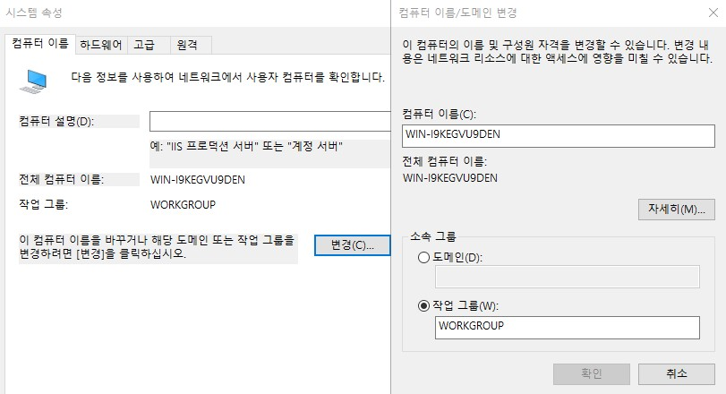

* 도메인을 등록하여 Member Server로 등록하면 된다.

# 실습

__LON-SVR1__ 에 powershell을 통하여 AD DS를 설치한다.

```powershell
Install-WindowsFeature -Name AD-Domain-Services -ComputerName LON-SVR1
```

* 위의 코드를 통하여 Domain Service를 설치한다.

```powershell
Get-WindowsFeature -ComputerName LON-SVR1
```

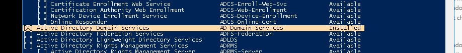

* 위의 코드를 입력하여 설치를 확인한다.

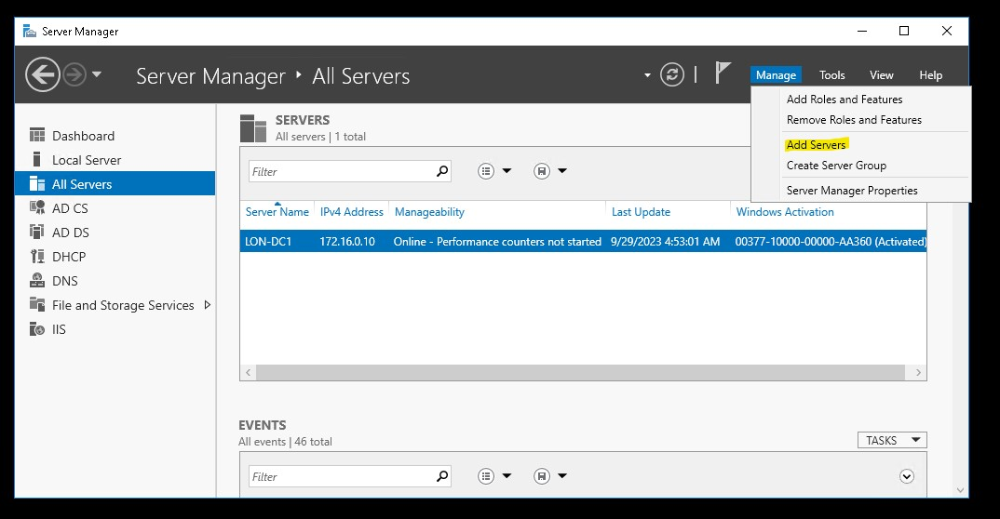

* __LON-DC1__ 으로 다시 돌아와서 서버를 추가한다.

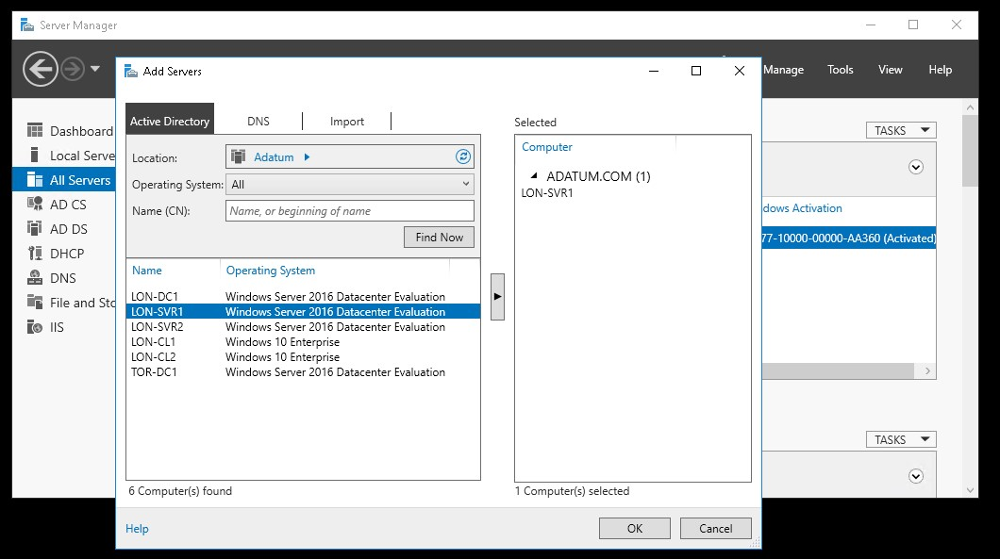

* DC의 Server Manager에서 한 번에 관리하기 위해서는 등록할 필요가 있다.
* 도메인을 선택한 후 find를 누르게 된다면 child 혹은 member server들이 나오게 된다.
* 따라서 DS를 설치한 member server를 Server Manager에 추가한다.

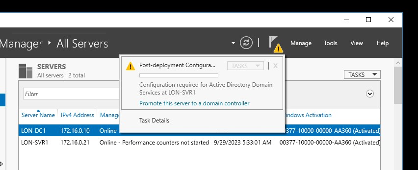

* LON-DC1에서 LON-SVR1을 DC1이 될 수 있도록 설정 한다.

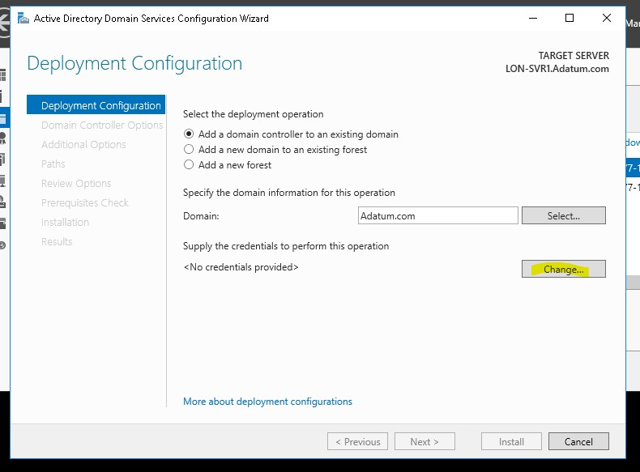

* 기존 Adatum.com 도메인에 DC를 하나 더 추가한다.
* DC를 설치하기 위해서는 인증이 필요하다.

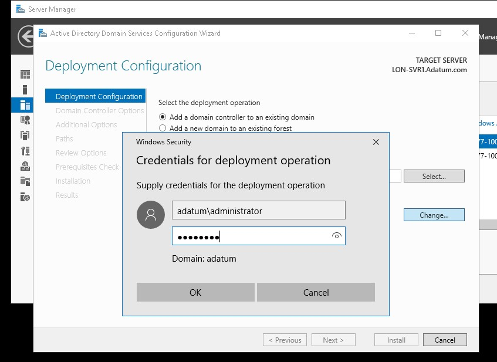

* 도메인 관리자 계정으로 접속하여 인증을 받는다.

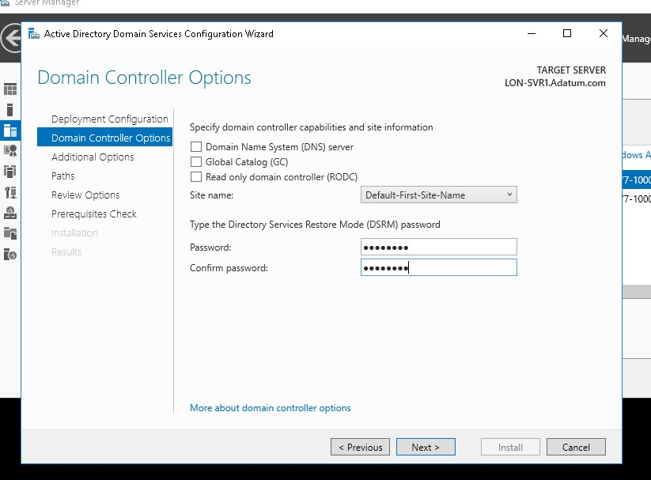

1. DNS 체크를 푼다.
2. GC 체크를 푼다.
3. RODC 체크를 푼다.

* DSRM은 Directory Service의 복구 모드로 복구 모드 비밀번호를 설정한다.

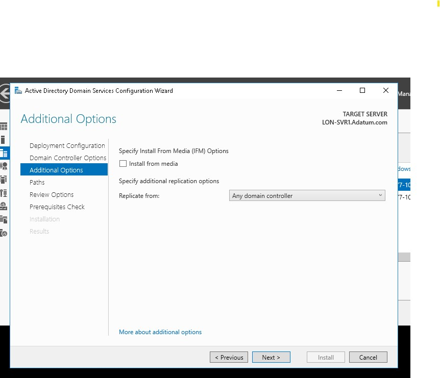

* IFM을 설치하지 않고 넘어간다.

## IFM 이란?

* 네트워크 대역폭이 낮거나 보안 상의 이유로 네트워크에서 DC 간의 통신을 통하여 복제하지 못하는 경우 USB와 같은 디스크를 통해서 복제하는 전략이다.

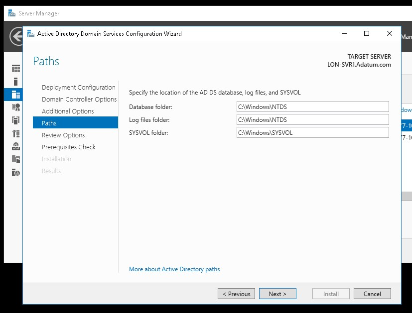

* 기본 설정이다.

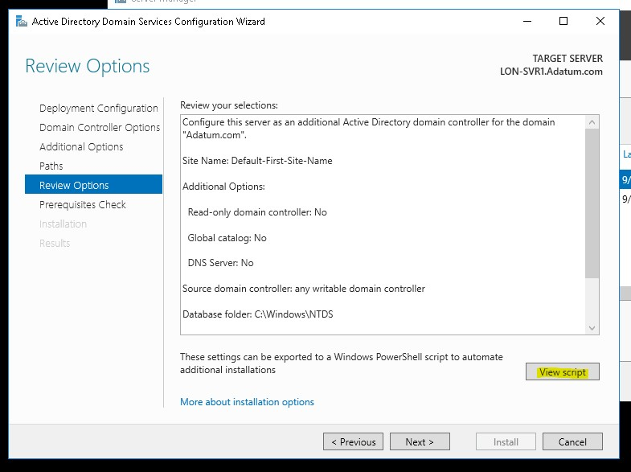
* View Script를 통하여 지금까지의 powershell 설정을 가져온다.

```powershell
Invoke-Command -ComputerName LON-SVR1 { 내용 }
```

* Script 내용을 아래 조건에 맞혀서 변환 후 위 내용에 넣는다.
    1. __\#__ 주석 제거
    2. __Import-Module__ 를 제거
    3. __grave accents (`)__ 를 제거
    4. __개행문자 (\n)__ 을 제거한다.


```powershell
invoke-command -computername lon-svr1 -scriptblock { Install-ADDSDomainController -NoGlobalCatalog:$true -Credential (Get-Credential) -CriticalReplicationOnly:$false -DatabasePath "C:\Windows\NTDS" -DomainName "Adatum.com" -InstallDns:$false -LogPath "C:\Windows\NTDS" -NoRebootOnCompletion:$false -SiteName "Default-First-Site-Name" -SysvolPath "C:\Windows\SYSVOL" -Force:$true }
```

* 완성된 코드를 __LON-DC1__ 의 powershell에 입력한다.

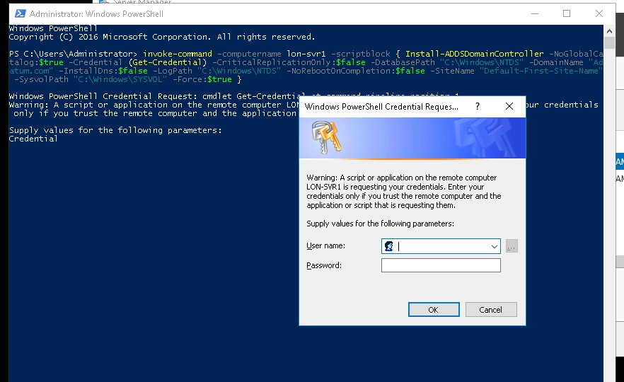

* DC 에서 권한 인증을 받아야 하기 때문에 도메인 관리자 계정으로 접속하여 인증을 받는다.

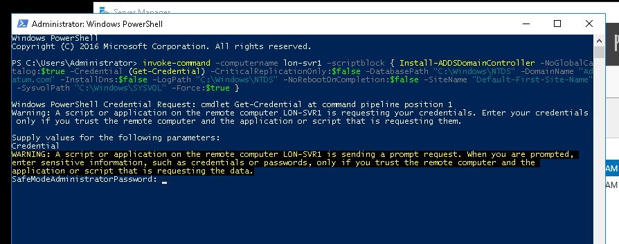

* 설치를 위하여 safe모드로 비밀번호를 다시 입력한다.

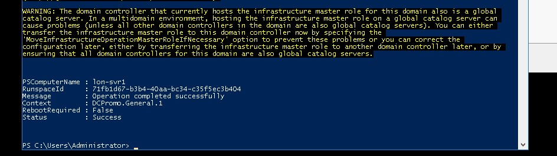

* 설치가 완료하게 되면 __LON-SVR1__ VM이 자동으로 power off가 되고 다시 시작하는 것을 볼 수가 있다.
* 그 후 __LON-DC1__ 의 Server Manger를 Refresh하면 DS의 DC remote flag가 사라진 것을 볼 수 있다. 

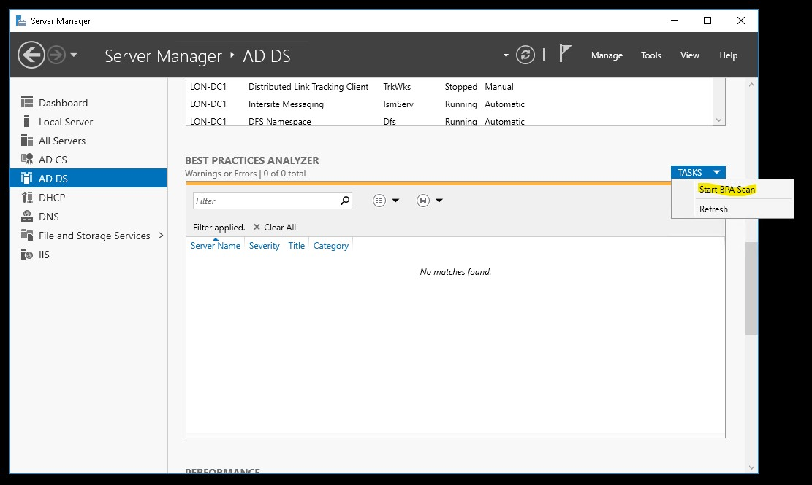

* __LON-DC1__ 의 Server Manager의 AD DS 탭에 들어가서 Start BPA Scan을 선택한다.

## BPA(Best Practices Analyzer) 란?

* Active Directory 환경을 평가하고 최상의 관리 및 보안 관행을 준수하는 데 도움을 주는 도구이다.
* AD 환경에서 발생할 수 있는 잠재적인 문제를 탐지하고 권장 사항을 제공하여 네트워크 관리자가 환경을 최적화하고 문제를 해결하는 데 도움을 준다.

<br>

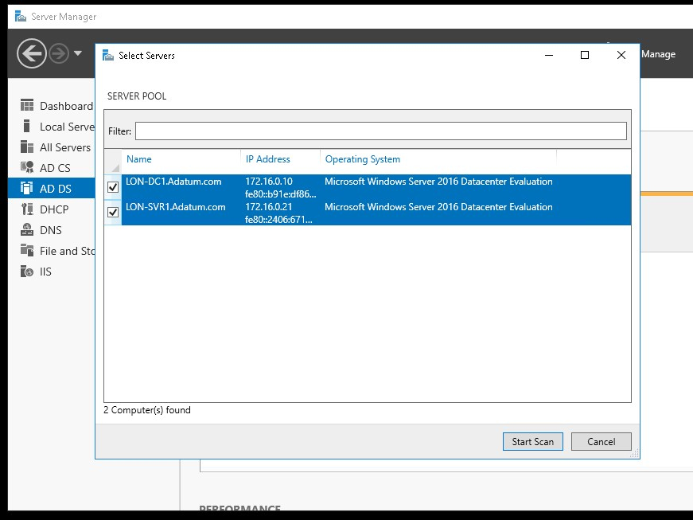

* 2 개의 DC를 모두 선택한다.

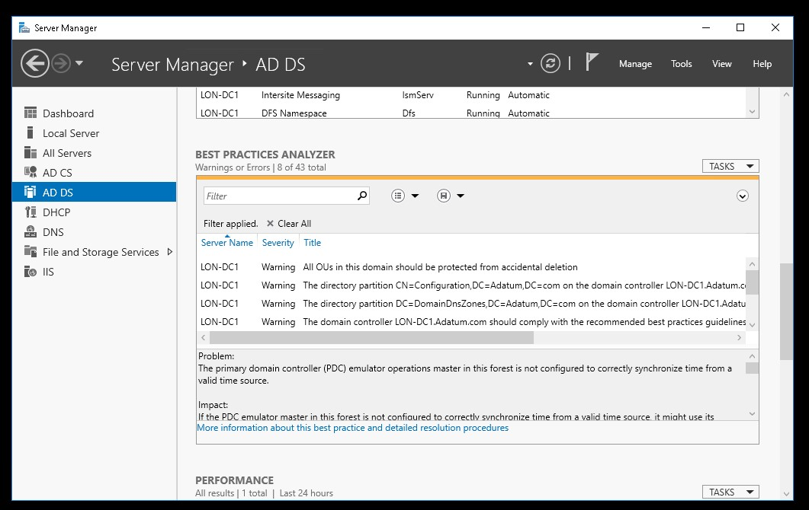

* 위와 같이 결과가 나오는 것을 볼 수 있다.