# Deploying domain controllers by performing domain controller cloning

Hyper-v VM 추출을 통한 DC 복제

# 실습

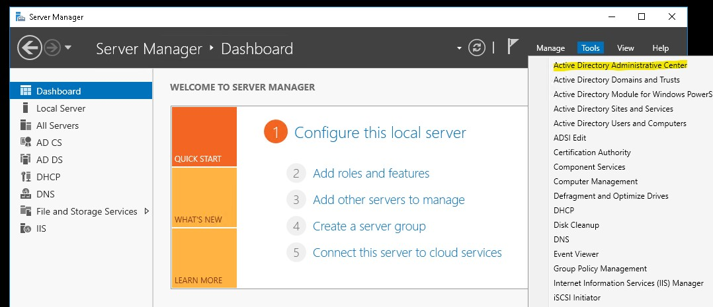

* __LON-DC1__ 의 Server Manager에 Active Directory Administrative Center로 이동한다.

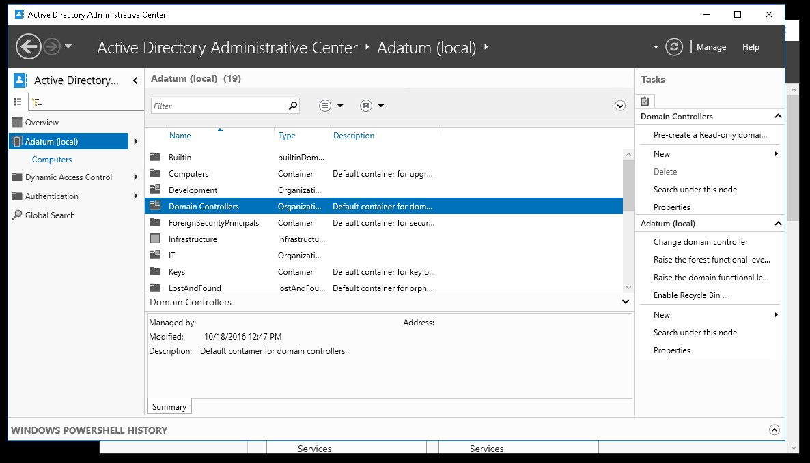

* Adatum (local)의  Domain Controllers OU(organizational unit)로 이동한다.

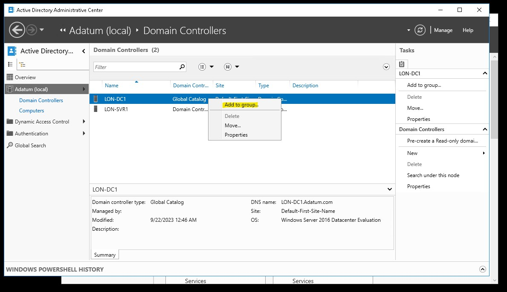

* DC1에 그룹을 추가한다.

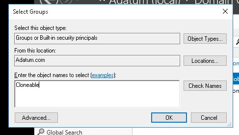

* __Cloneable__ 을 입력한 후 Check Names를 누른다.

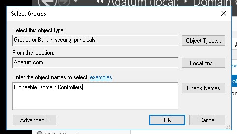

* __Cloneable Domain Controllers__ 가 나오면 OK를 누른다.

## Cloneable Domain Controllers 란?

* Active Directory (AD)에서 Windows Server 2012 이상에서 도입된 보안 및 복제 관련 개선 기능 중 하나이다.
* 이 그룹은 Active Directory의 복제를 향상시키고 AD 도메인 컨트롤러(Domain Controller)를 쉽게 복제할 수 있도록 도와준다.

<br>

```powershell
Get-ADDCCloningExcludedApplicationList
```

* 도메인 컨트롤러 복제나 클로닝 프로세스 중에 제외된 응용프로그램 목록을 반환한다.

```powershell
Get-ADDCCloningExcludedApplicationList -GenerateXML
```

* 응용프로그램 목록을 XML 형식으로 생성하여 반환한다.

```powershell
New-ADDCCloneConfigFile
```
*  Active Directory 복제 서비스에서 사용할 클론 구성 파일을 생성한다.

```powershell
Stop-Computer
```

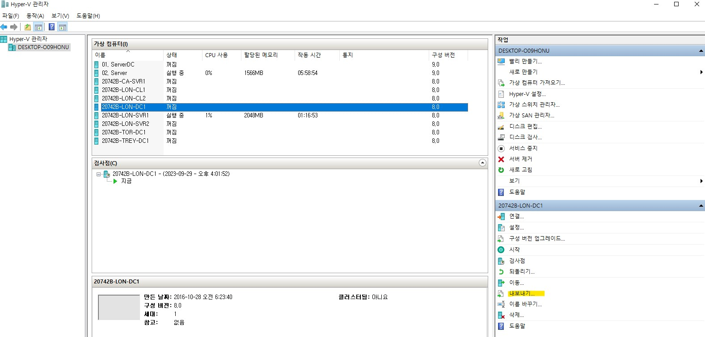

* VM에 대한 정보를 내보내기(export) 한다.

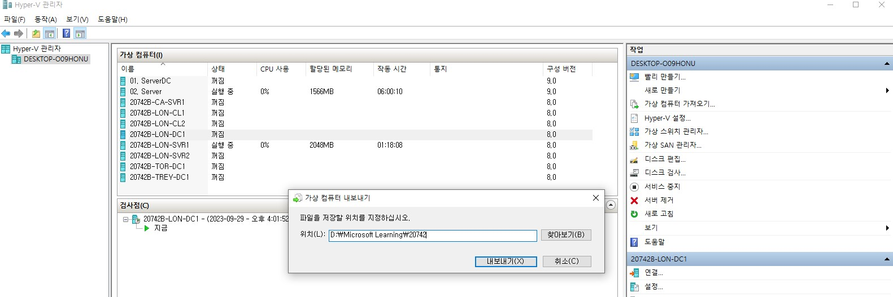

* VM 구성 파일을 저장할 곳을 정한다.
* __D:\Microsoft Learning\20742__ 로 설정하였다.

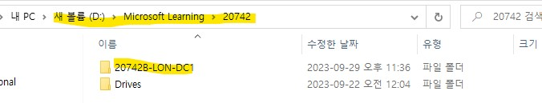

* 위에서 설정한 경로에 생성된 것을 볼 수 있다.

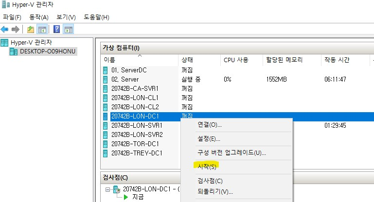

* 복사한 VM을 다시 설치하기 전 기존의 VM을 먼저 실행시킨다.

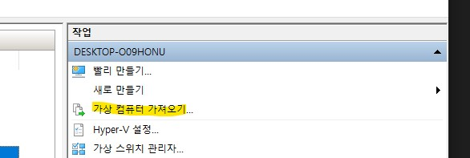

* VM을 가져온다.

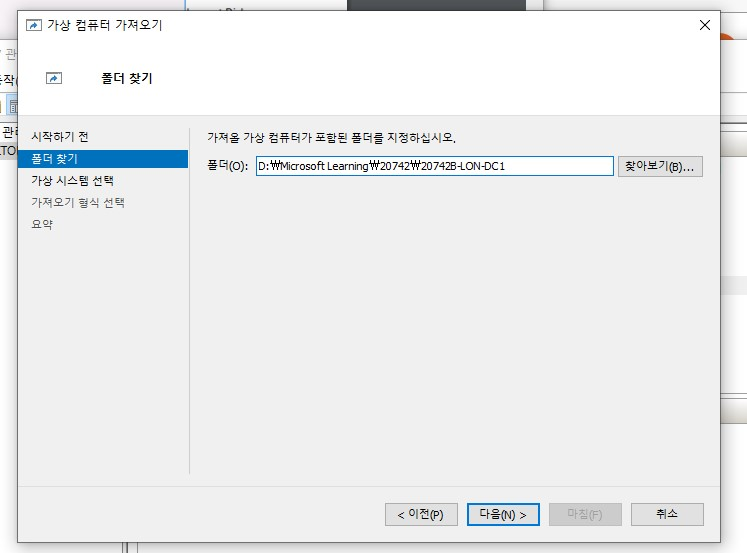

* 아까 저장한 VM 구성 파일의 위치를 입력한다.
* 위치: __D:\Microsoft Learning\20742\20742B-LON-DC1__

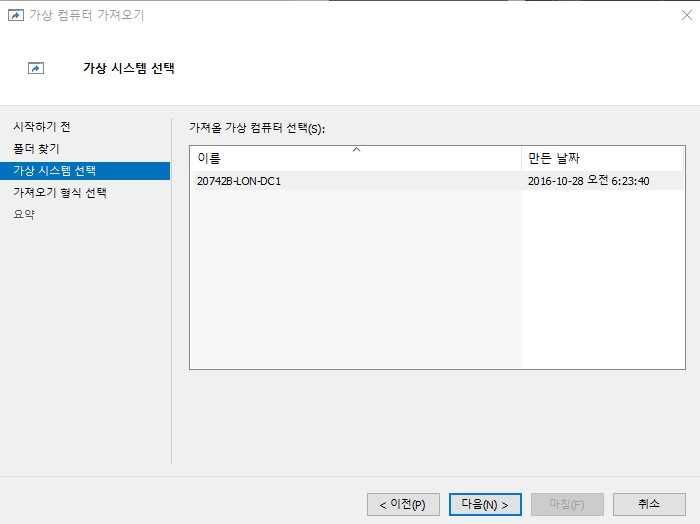

* 가져올 VM을 선택한다.

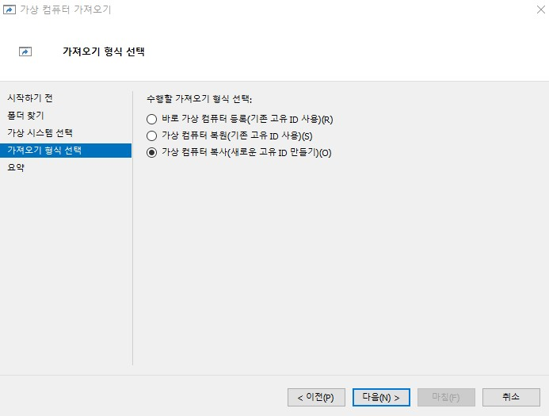

* clone 하는 것이 목표이기 때문에 새로운 고유 ID로 생성한다.

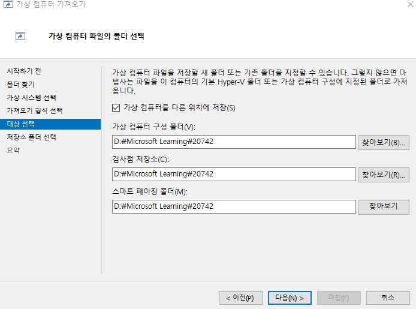

* 가상 컴퓨터를 다른 위치에 저장한다.
* 위치: __D:\Microsoft Learning\20742__

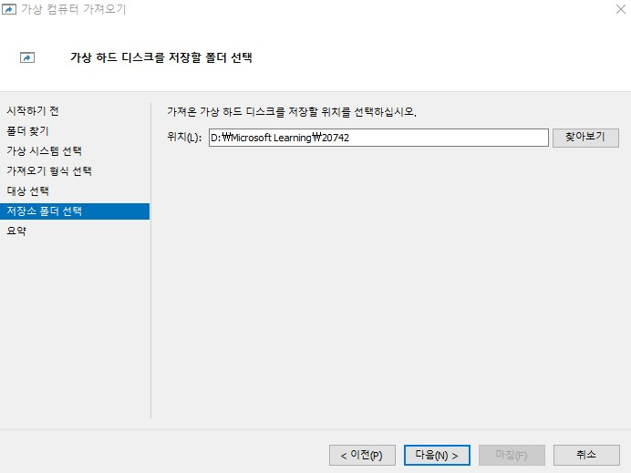

* 새로운 VM 디스크를 저장할 곳을 정한다.

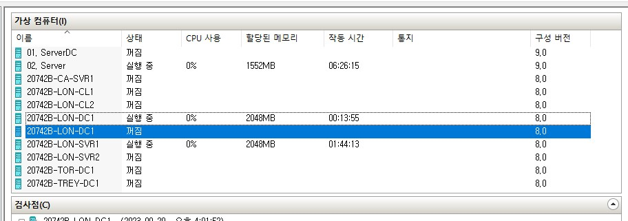

* 복제한 VM은 기존의 VM과 같은 이름이기 때문에 이름을 바꾸어준다.

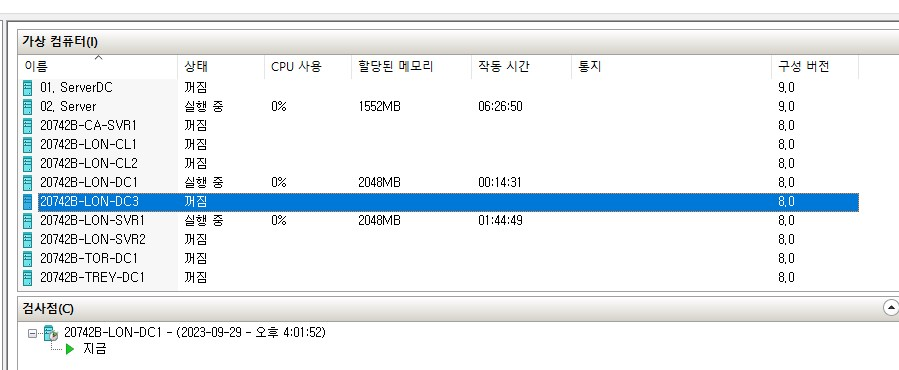

* 여기서는 __20742B-LON-DC3__ 로 설정하였다.

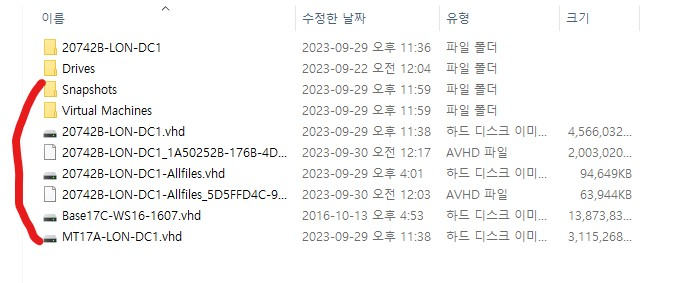

* 위에서 설정한 VM 구성 파일들이 생성된 것을 볼 수 있다.

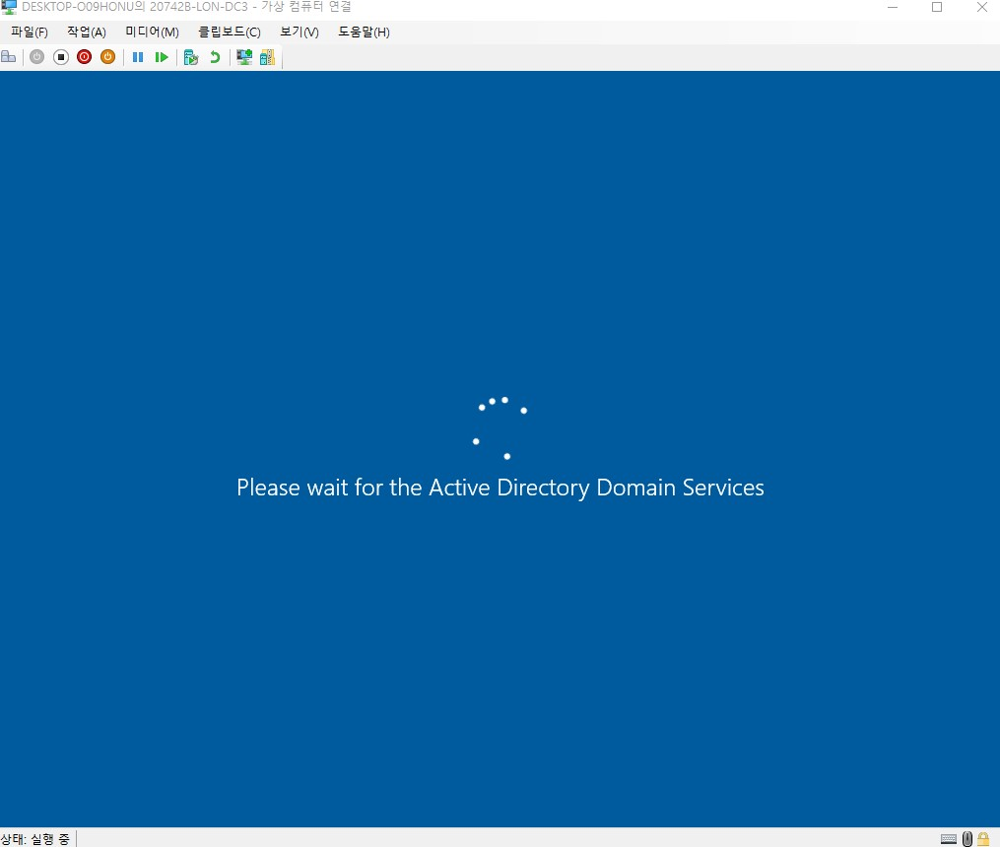

* 그 후, VM을 시작한 후, Acitve Directory Domain Services가 나오면 성공이다.
* 생각 보다 되게 오래 걸린다... 약 40분 정도

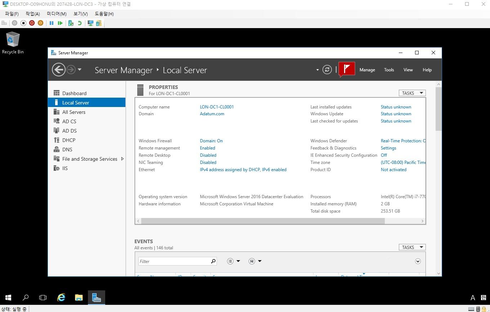

* AD 설정이 그대로 잡혀 있는 것을 확인할 수 있다.

