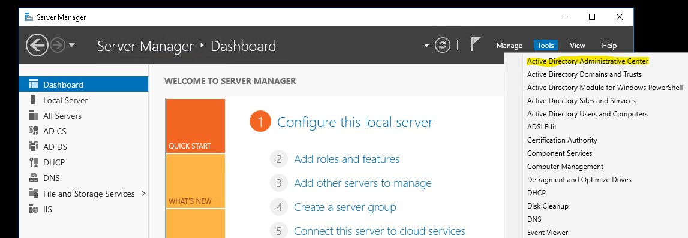
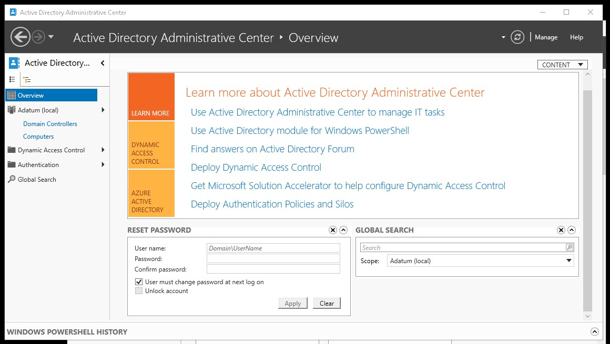
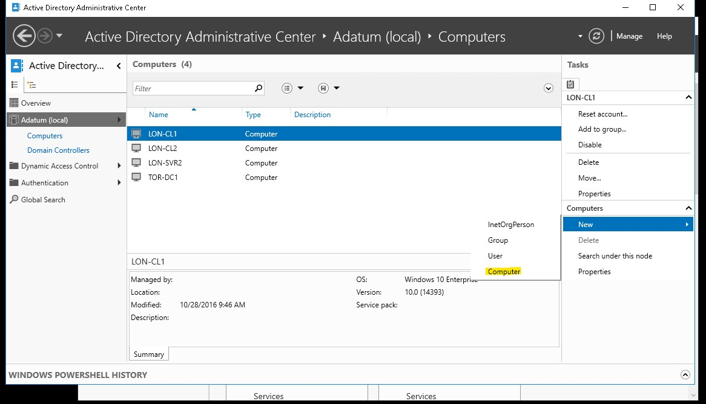
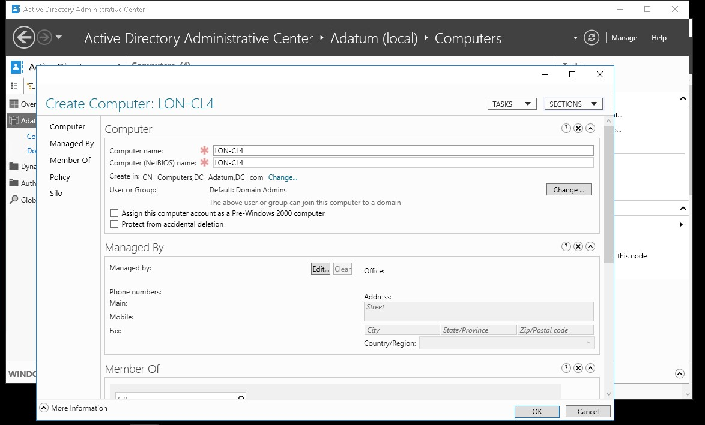
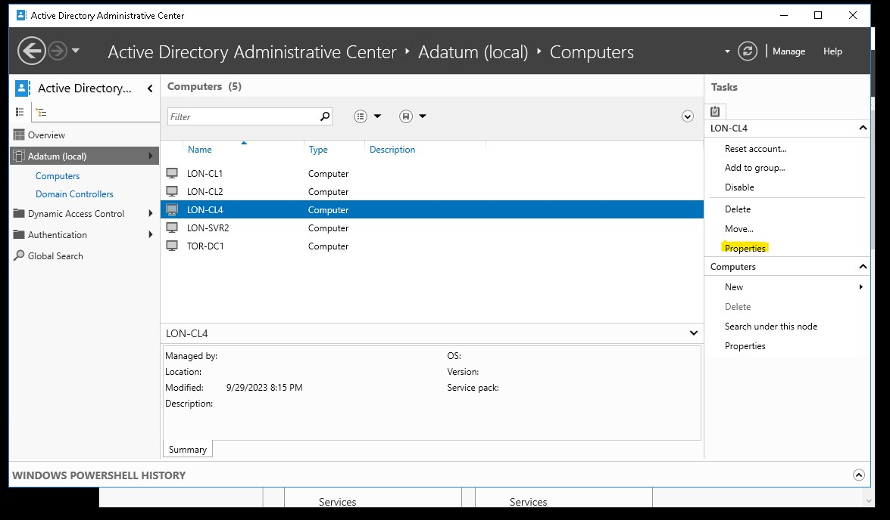
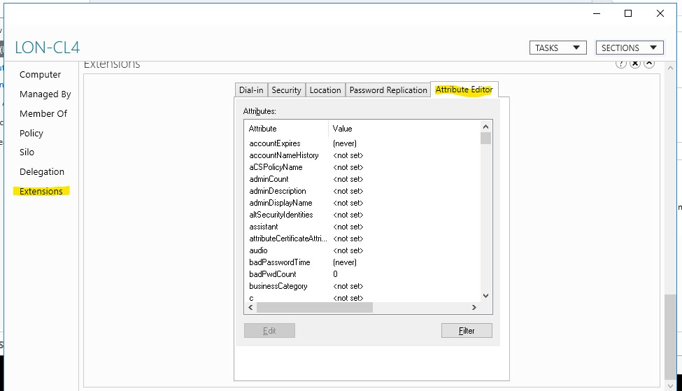
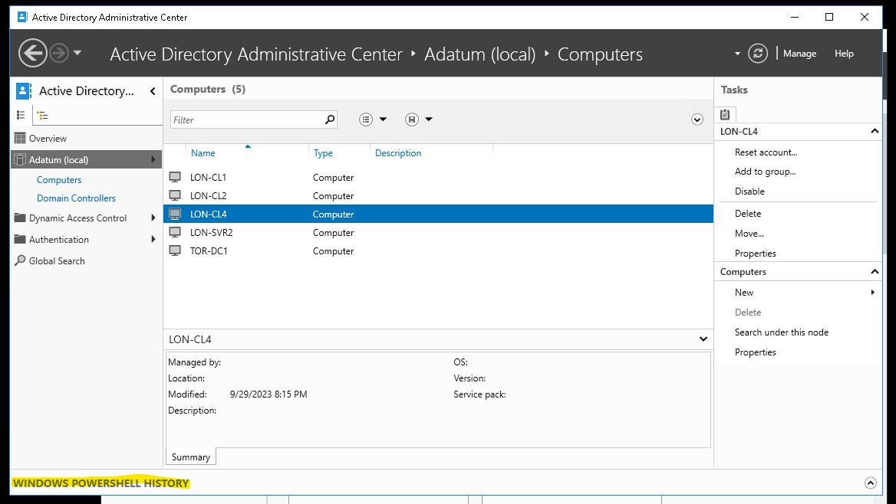
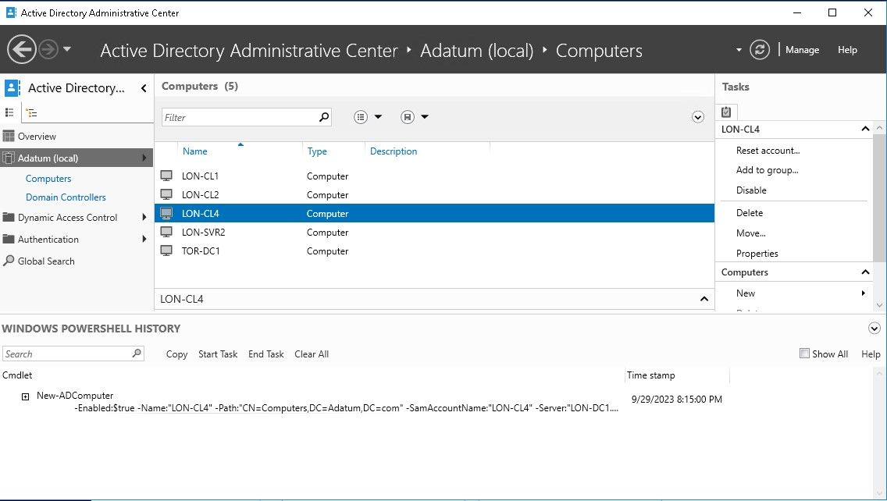

# Administering AD DS

AD 관리 센터를 사용하여서 Object를 쉽게 컨트롤 할 수 있다.

# 실습

* __LON-DC1__ 의 Server Manager에 Active Directory Administrative Center를 클릭한다.

* Overview를 통하여 object 관리가 가능하다.
    1. __RESET PASSWORD__ : USER 객체의 password 변경이 가능하다.
    2. __GLOBAL SEARCH__ : 찾고 싶은 Object를 조회할 수 있다.

* 컴퓨터 개체를 미리 생성할 수 있다.

* 미리 생성할 컴퓨터 개체를 입력한다.
    1. Computer name: LON-CL4
    2. Computer (NetBIOS) name: LON-CL4

* 이제 생성한 컴퓨터 개체의 속성에 들어간다.

* Extensions -> Attribute Editor에 들어가서 특성을 변경할 수 있다.

* 그 후 속성을 나와서 하단의 __WINDOWS POWERSHELL HISTORY__ 를 클릭하여 지금까지의 powershell history를 볼 수 있다.

* 위와 같이 표시된다.
* 왠만한 특성 값은 다 가능하지만 GUI가 아닌 powershell로만 가능한 것이 있다.