# Creating and managing groups in AD DS

AD Domain Service를 사용하여 그룹을 생성하고 관리한다.

# 실습

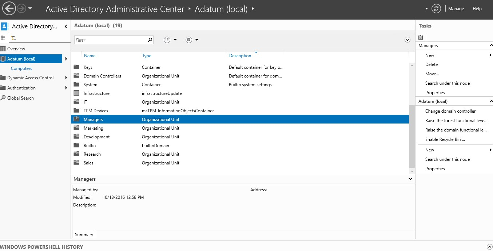

* __Managers__ OU를 선택한다.

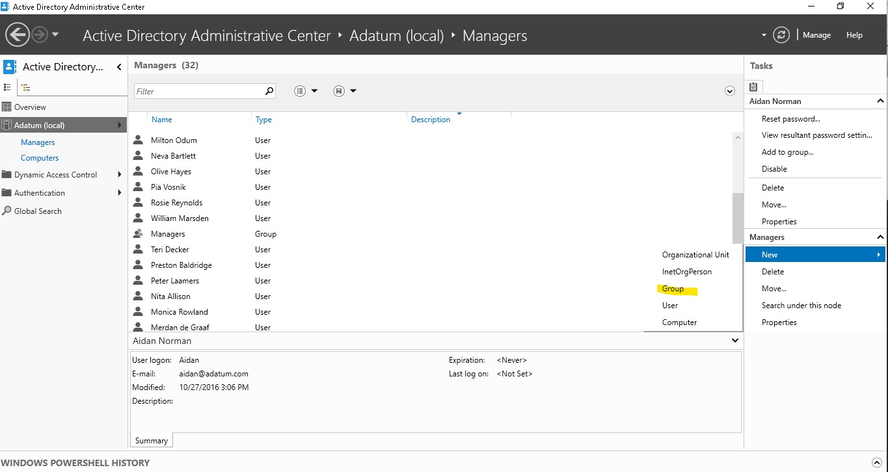

* __Managers__ OU에 새로운 그룹을 추가한다.

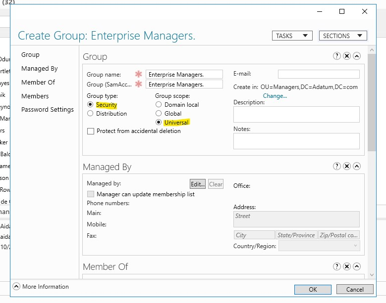

* __Enterprise Managers__ 그룹을 생성한다.
    1. Group type 는 Security
    2. Group Scope는 Universal로 한다.

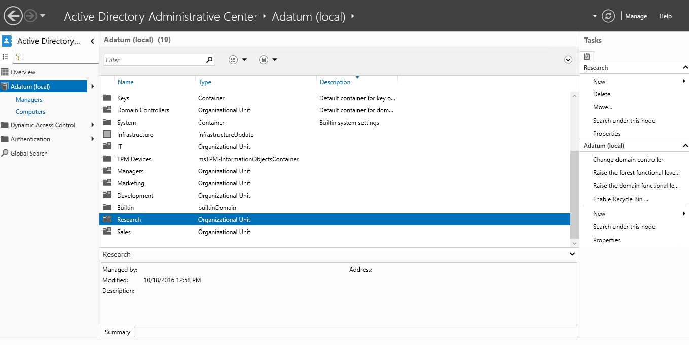

* __Research__ OU를 선택한다.

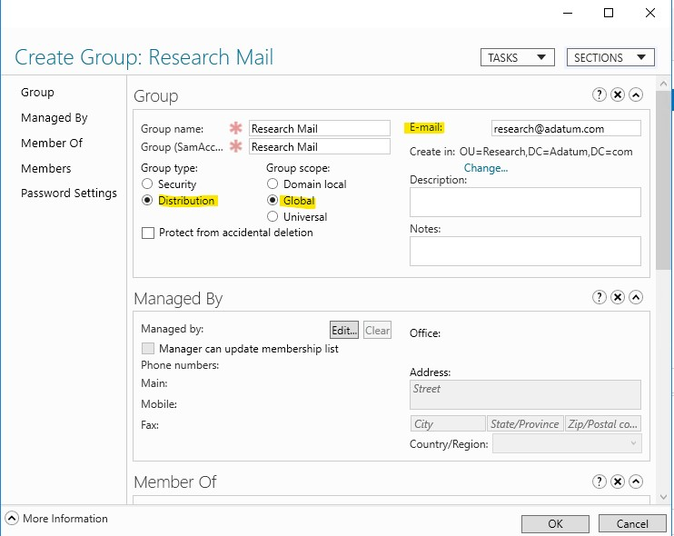

* __Research Mail__ 이라는 새로운 그룹을 생성한다.
    1. Group type 는 Distribution
    2. Group Scope는 Global로 한다.
    3. E-mail은 research@adatum.com 으로 한다.

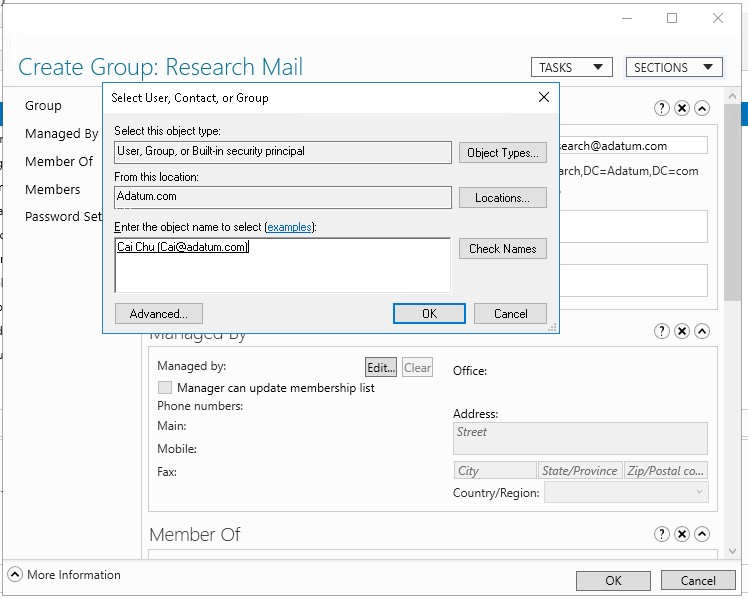

* Managed By에서 Edit을 선택한다.
* 그 후 Cai를 입력한 후, Check Name을 통하여 정확한 사용자를 찾는다.

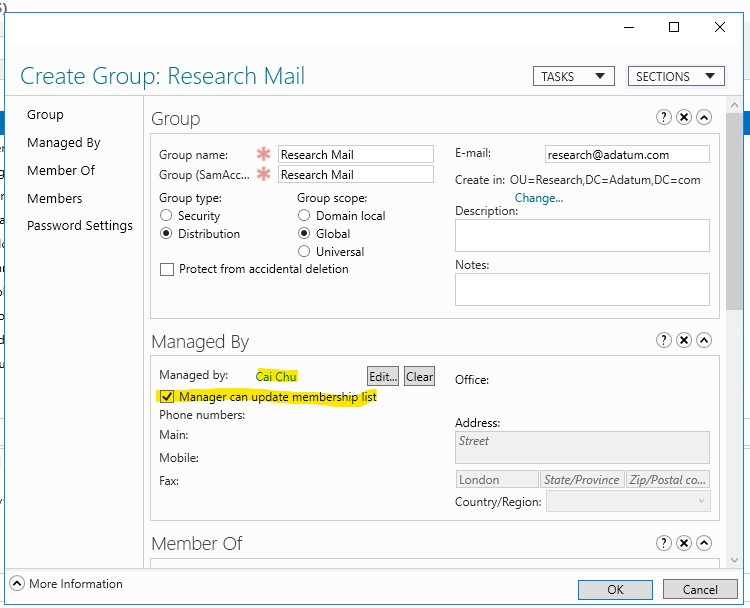

* Manager can update membership list를 체크하고 그룹을 생성한다.

## Managed by란?

* Managed by는 관리자 역할로 그룹을 관리할 수 있다.
    * User 개체과 그룹을 관리할 수 있으며, 그룹이 그룹을 관리할 수 있다.

* Manager can update membership list를 체크하게 된다면 관리자가 구성원 목록(Members)을 업데이트 할 수 있다.

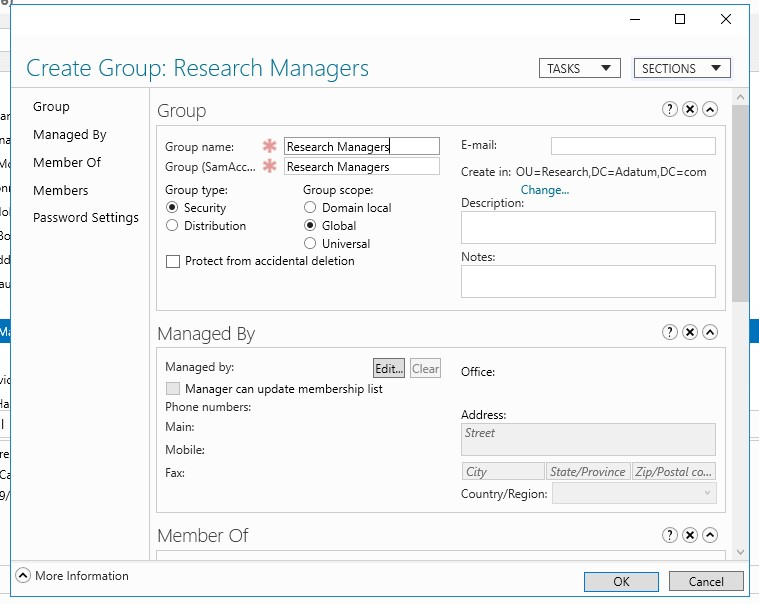

* Research OU에 그룹을 하나 더 생성한다.
* 그룹 이름을 __Research Managers__ 로 설정한다.
    1. Group type 는 Security
    2. Group Scope는 Global로 한다.

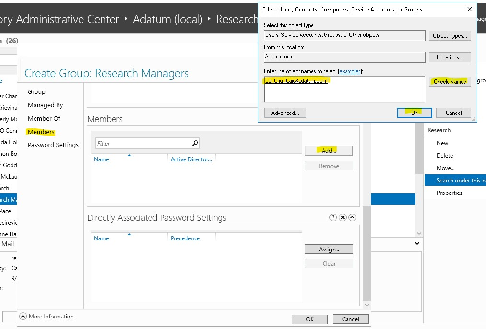

* 구성원에 Cai Chu를 추가한다.

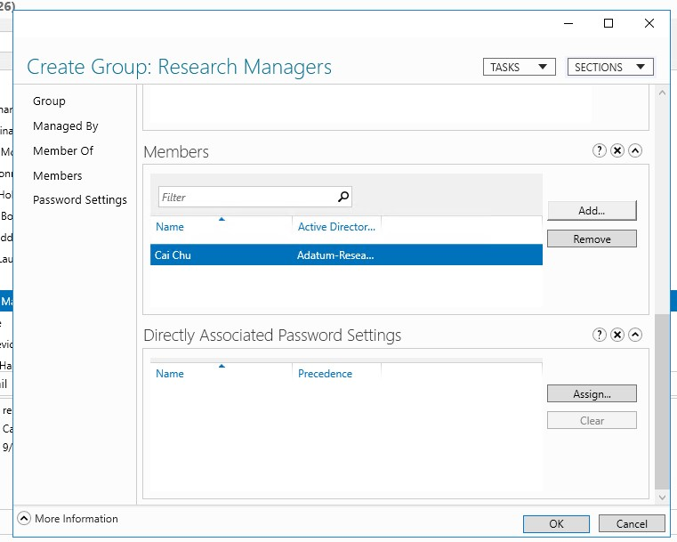

* 구성원을 추가한 후 그룹을 생성한다.

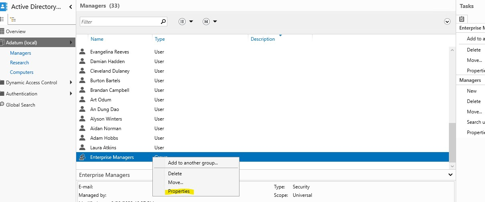

* Managers OU로 다시 이동하여 __Enterprise Managers__ 그룹 속성에 들어간다.

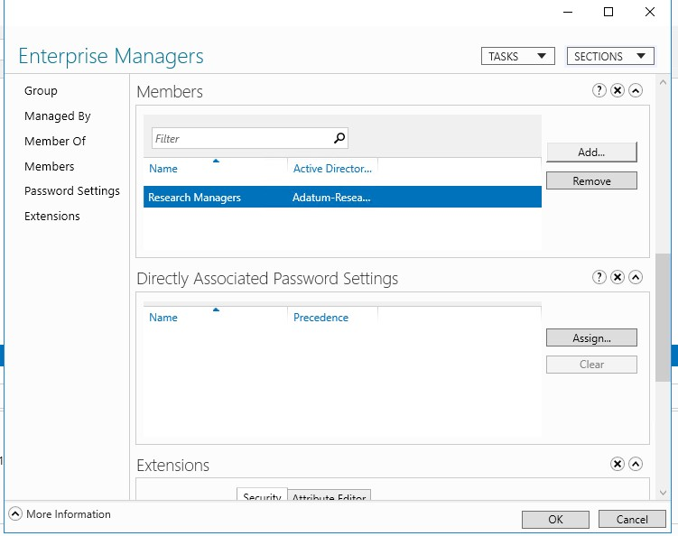

* 멤버에 __Research Managers__ 그룹을 추가한다.

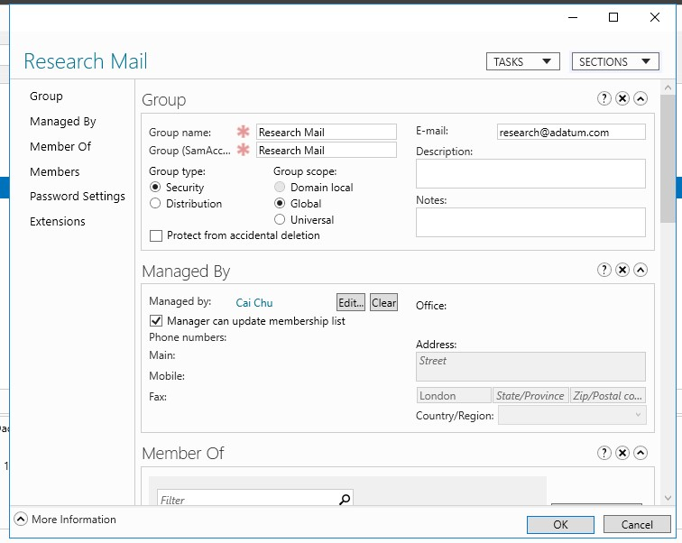

* 기존 그룹 type을 Distribution -> Security로 변환 가능하다.

# 결론

1. 그룹 관리자로 사용자 or 그룹이 관리할 수 있다.
2. 그룹 멤버에 그룹을 넣는 것이 가능하다.
3. 그룹의 type을 변경이 가능하다.