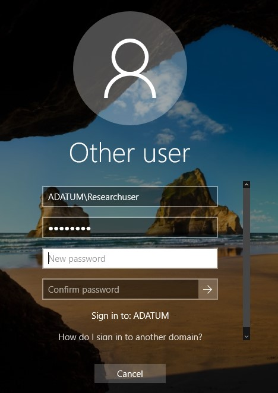

# Creating and configuring user accounts in AD DS

User 생성을 좀 더 쉽게하기 위하여 User Template을 작성한다.

# 실습


* 사용자 템플릿을 만들기 위하여 User object를 만든다.


* User object의 정보를 채워 넣는다.
    1. First name: ResearchTemplate
    2. UPN: ResearchTemplate
    3. Password
    4. Display name: Research Template
    5. Department: Research
    6. Company: Adatum

온-프레미스에서는 로그인하거나 할 때 SAM 방식(abc.com\\userA)으로 로그인 하는 것을 많이 보았을 것이다.
하지만 클라우드에서는 전부 UPN 방식(userA@abc.com)을 사용하여서 User를 생성한다.


* Manager에 __Cai Chu__ 가 이 User를 컨트롤 할 수 있게 설정한다.


* Member Of에서 add로 추가하여 ResearchTemplate이 Research 그룹에 들어갈 수 있게 한다.


* Profile -> Log on script 에 script를 추가한다.

```script
\\LON-DC1\Netlogon\Logon.bat
```

* Log on script 라는 것은 사용자가 로그온하게 되었을 때 작동하는 스크립트를 지정하는 기능이다.


* 사용자 계정을 좀 더 쉽게 만들기 위한 템플릿이다.
* 따라서 진짜 사용자가 아니기 때문에 사용을 못하게 한다.


* Active Directory Users and Computers 로 접속한다.


* 위에서 만든 __Research Template__ object를 찾은 후 Copy 한다.


* 기존의 것과 다르게 이름, SAM과 UPN을 설정한다.


* Password를 입력하고 위와 같이 설정하여 계정을 생성한다.


* 방금 생성한 User Object의 속성에 들어간다.


* Research Template에서 설정하였던 내용이 User Object에도 그대로 되어 있는 것을 확인 할 수 있다.


* 로그온 할 경우 Script가 작동하는데 첫 번째 로그온할 경우 비밀번호를 수정하는 내용이다.



* 비밀번호를 수정한다.


* 비밀번호 수정에 성공하였다.


* Researchuser는 관리자 그룹 혹은 관리자가 아니기 때문에 DC에 로그온하지 못 한다.
* 이를 통해서 로그온하던 도중에 접속을 차단하는 절차인 것을 알 수 있다.