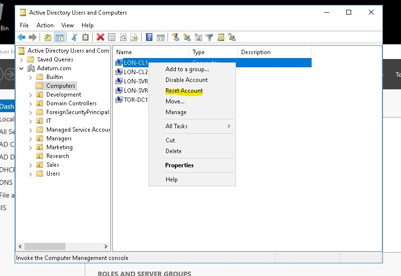
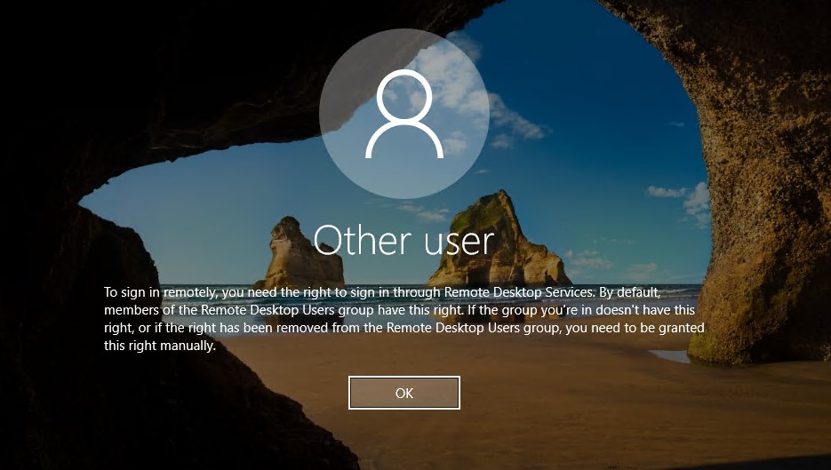
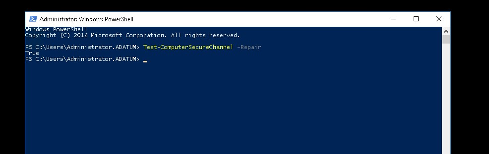
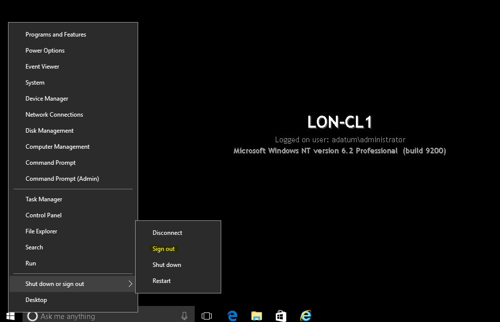
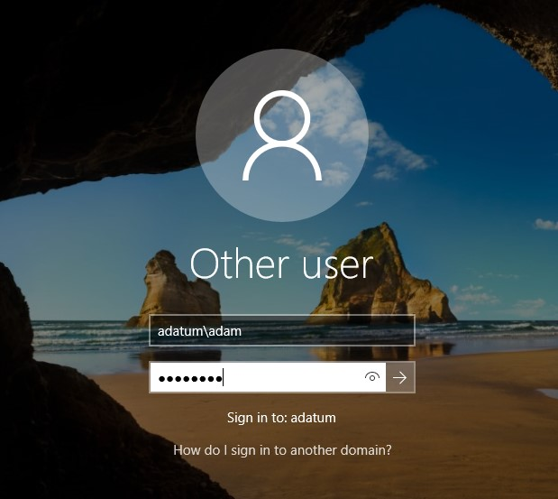
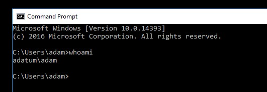

# Managing computer objects in AD DS

Computer Object를 리셋한 후, AD DS를 다시 동기화하는 방법

# 실습



* __LON-DC1__ 에서 Acticve Directory User and Computers에 접속한 후, __LON-CL1__ Object를 리셋한다.
* 리셋을 하게 되면 SID, 그룹 정책, 보안 설정, 도메인 멤버십이 다 초기화 된다. 



* __LON-CL1__ VM을 시작한 후, adatum\adam 계정으로 로그온 한다.
* 로그온이 불가능한 것을 보아 리셋하여 객체 정보가 없다.

__Adatum\administrator__ 로 접속하여 powershell에서 아래와 같은 명령어를 입력한다.

```powershell
Test-ComputerSecureChannel -Repair
```

* 컴퓨터의 Active Directory (AD) 보안 채널을 테스트하고 문제가 발견되면 복구하는 데 사용되는 명령어이다.




* 복구에 성공하면 True라는 문자열이 출력된다.



* 복구가 정말 되었는지 확인하기 위하여 로그아웃 한다.



* 아까 실패한 adatum\adam 계정으로 로그온 한다.



* 로그온에 성공한 모습을 볼 수 있다.