# Delegating administration for OUs

* OU들에 대한 권한을 위임한다.

# 실습

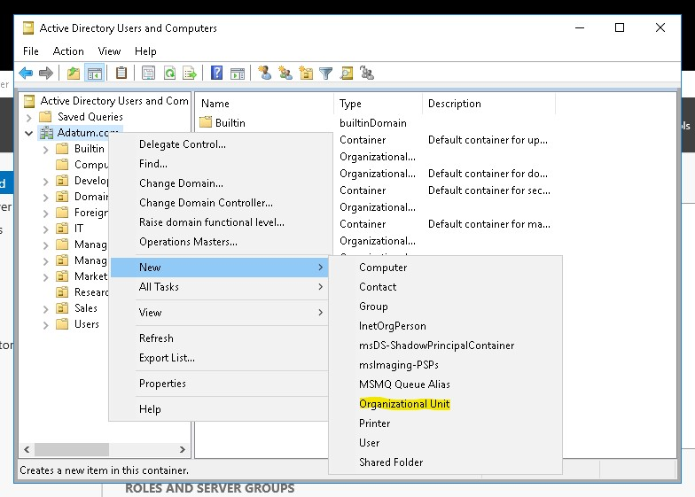

* __LON-DC1__ 에서 Active Directoty User and Computer에 접속한다.
* Adatum.com 도메인에서 새로 OU를 생성한다.

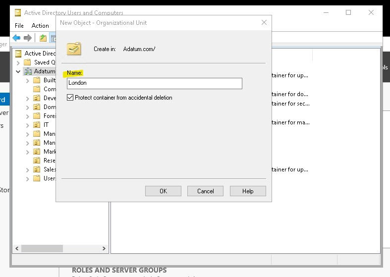

* 새로운 OU의 이름을 London으로 지정한다.

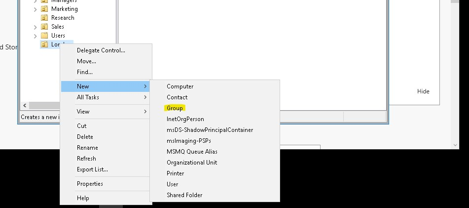

* London OU에 새로운 그룹을 추가한다.

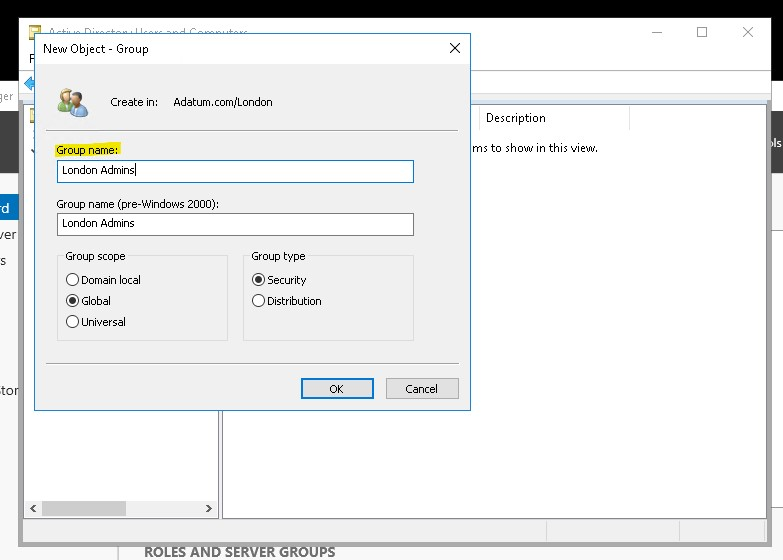

* Group의 이름은 __London Admins__ 이다.

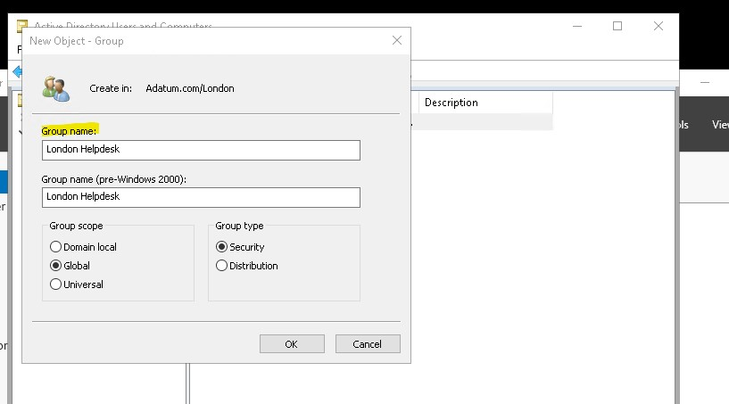

* 같은 방법으로 __London Helpdesk__ 도 생성한다.

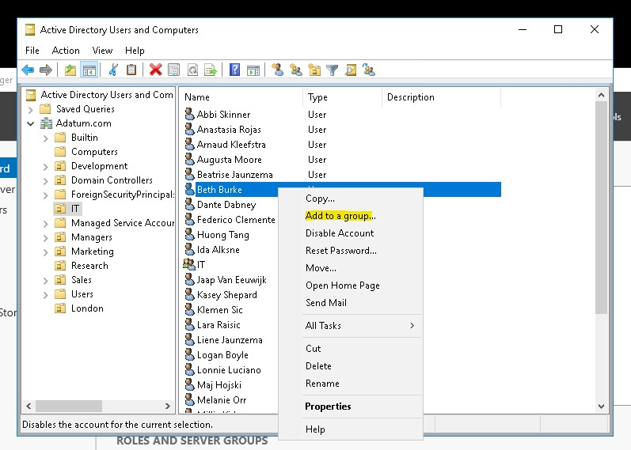

* IT OU에 있는 Beth Burke 를 새로운 그룹에 추가시킨다.

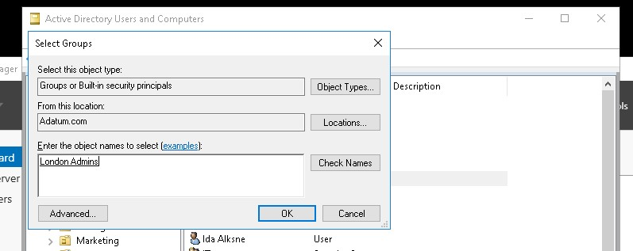

* 추가 시킬 그룹의 이름은 __London Admins__ 이다.

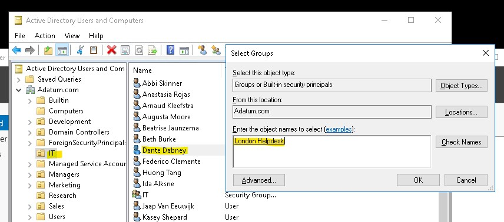

* 이와 같은 방법으로 IT OU에 있는 Dante Dabney를 __London Helpdesk__ 그룹에 추가한다.

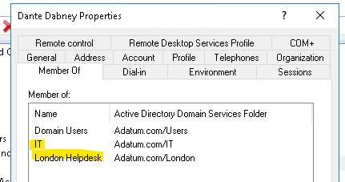

* 여기서 알 수 있는 점은 User Object는 여러 그룹에 속할 수가 있다.

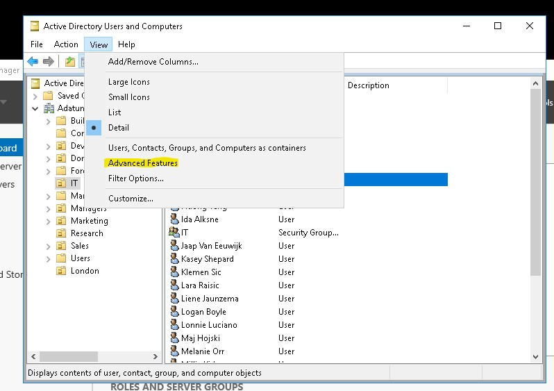

* View에서 고급 기능 보기를 선택한다.

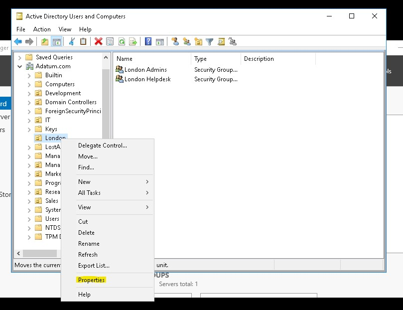

* London OU의 속성에 들어간다.

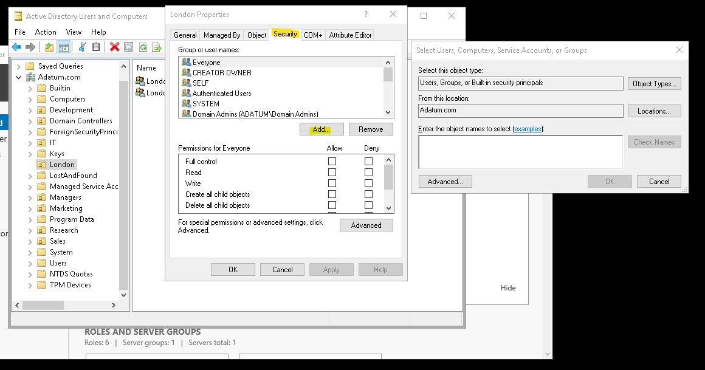

* Security -> Add에서 새로운 그룹을 보안 그룹에 추가한다.
* _만약 Security 탭이 안 보인다면 View에서 Advanced Features를 선택했는지 다시 확인하자_

* __London Admins__ 를 추가한다.

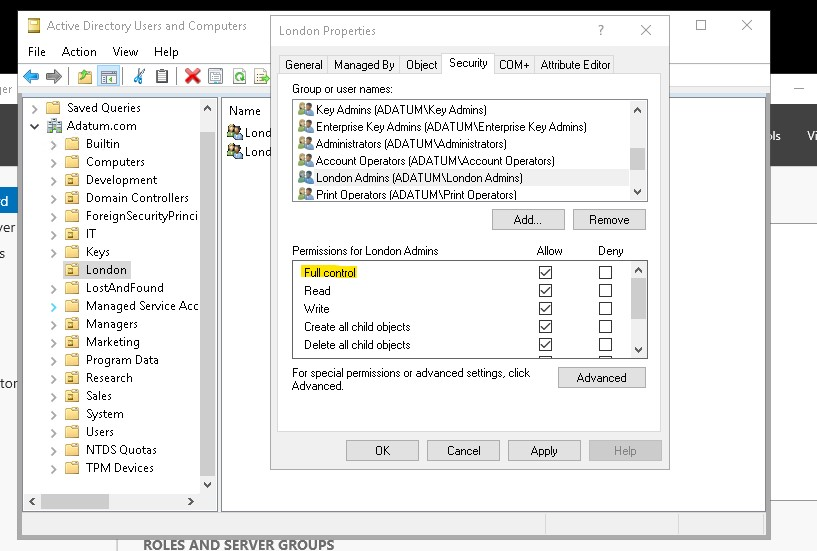

* __London Admins__ 가 __London__ OU에 대한 모든 사용 권한을 얻을 수 있게 한다.

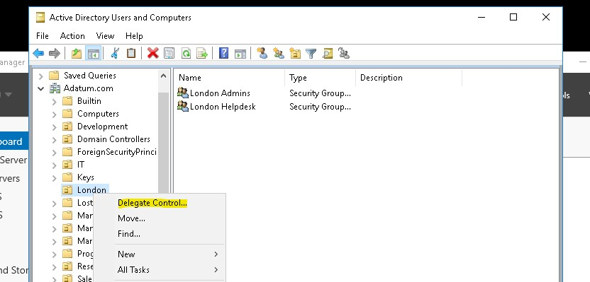

* __London__ OU에 제어를 위임한다.

## Delegate Control(제어 위임)이란?

* Delegate Control을 사용하여 특정 사용자에게 Active Directory의 사용자 및 그룹을 수정할 수 있는 권한을 부여할 수 있다. 또한 조직의 관리자처럼 AD 서버에 직접 로그인 하지 않고 사용자의 PC에 Remote Server Administration Tool을 설치하여 AD에 Access 할 수 있다. 
* 관리자의 Active Directory 관리 부담을 덜어 줄 뿐만 아니라 일부 관리 권한이 필요한 사용자가 AD 서버에 직접 로그인 하지 않으므로 보안적인 측면에서도 유용하다.

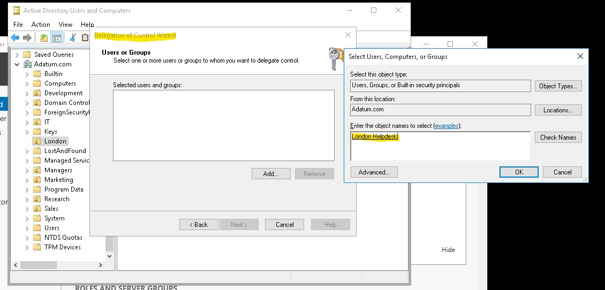

* __London Helpdesk__ 그룹을 추가한다.

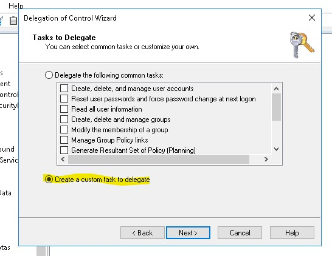

* 하단의 __Custom task to delegate__ 를 추가한다.

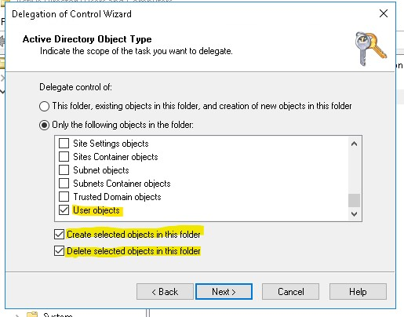

* __User Object__ 만 선택한다.
* 아래 2개도 체크해야 Object를 생성하고 삭제할 수 있다.

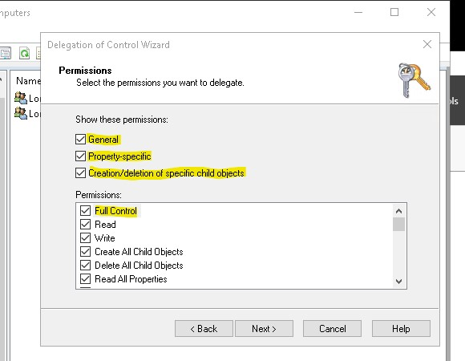

* 이에 대한 모든 권한을 받는다.

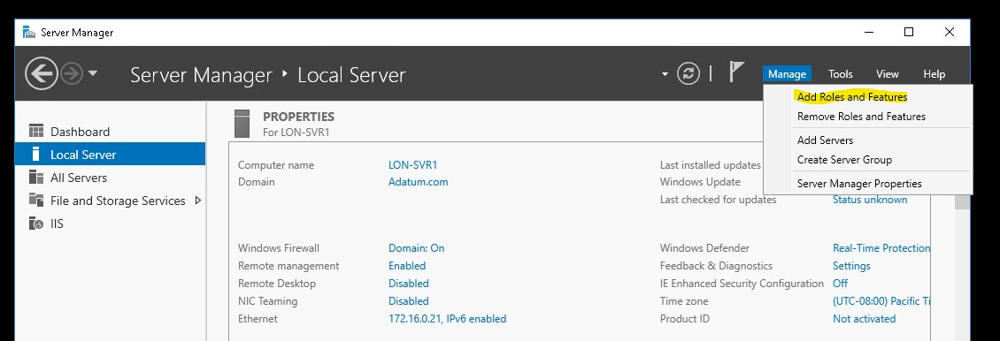

* __LON-SVR1__ VM을 동작시킨 다음 새로운 역할을 추가한다.

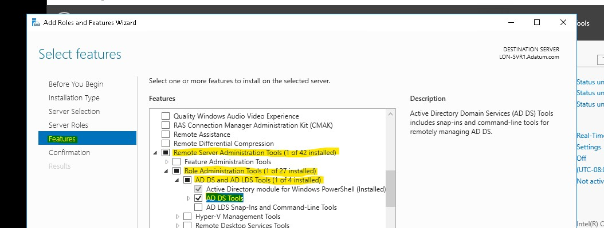

* Features에 들어가서 __AD DS Tools__ 를 설치한다.

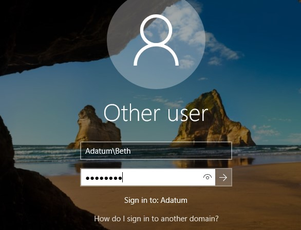

* 이제 잘 설치 되었는지 __Beth__ 계정으로 로그온 한다.
* 위에서 Beth User는 __London Admins__ 그룹에 포함되어 있다.
* 위에서 __London Admins__ 그룹은 London OU에 대한 권한을 Security에 추가하였다.

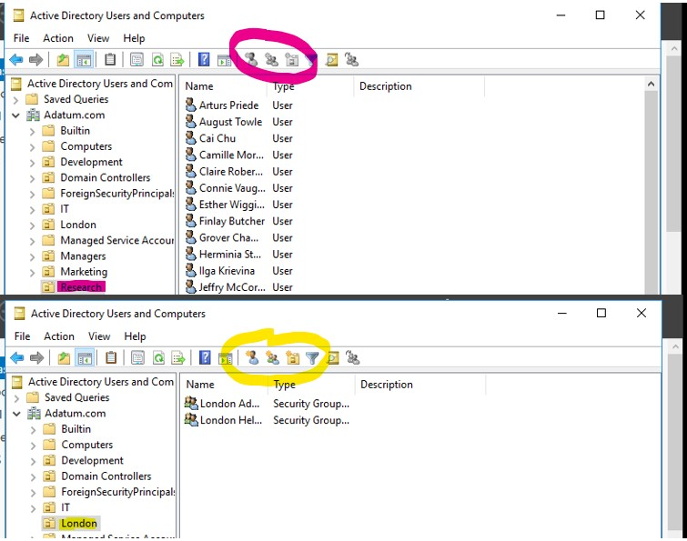

* 따라서 Research OU에는 권한이 없지만 London OU에는 권한이 있기 때문에 사용할 수 있다.

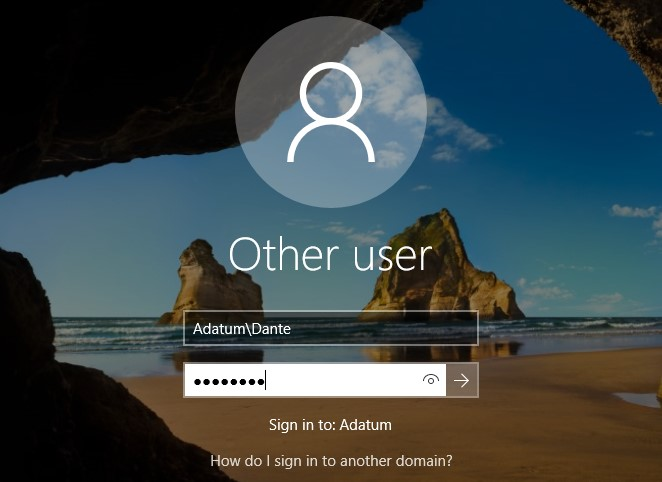

* 이번에는 __London Helpdesk__ 그룹에 위치한 Dante로 로그온 한다.

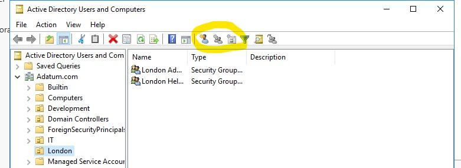

* __London Helpdesk__ 그룹은 User object의 생성과 삭제에 대한 Delegate Control(권한 위임)을 받았다.
* 따라서 User 생성 아이콘만 활성화 되어 있는 모습을 볼 수 있다.