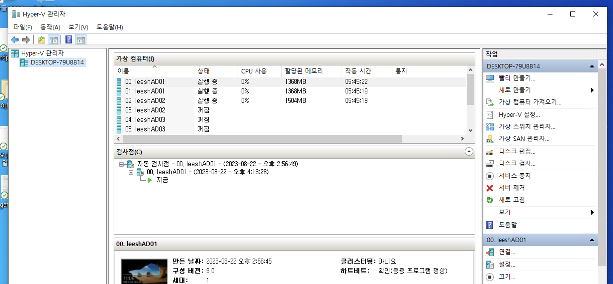
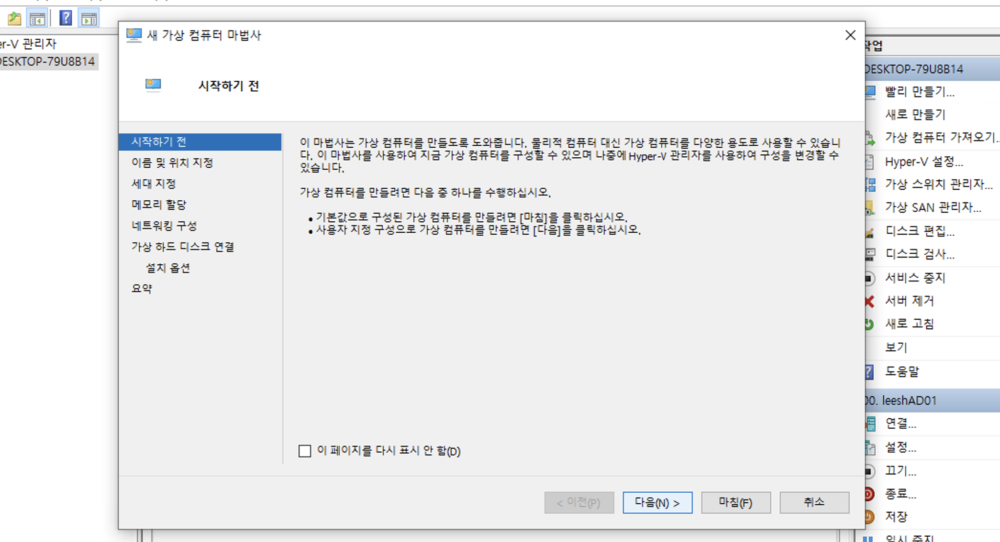
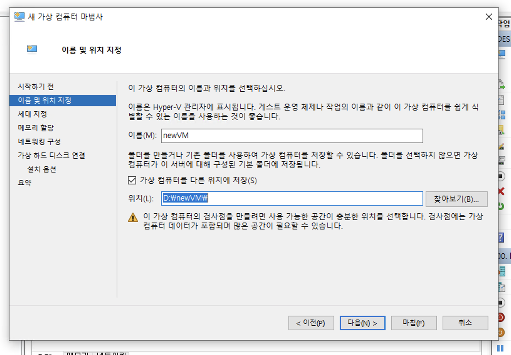
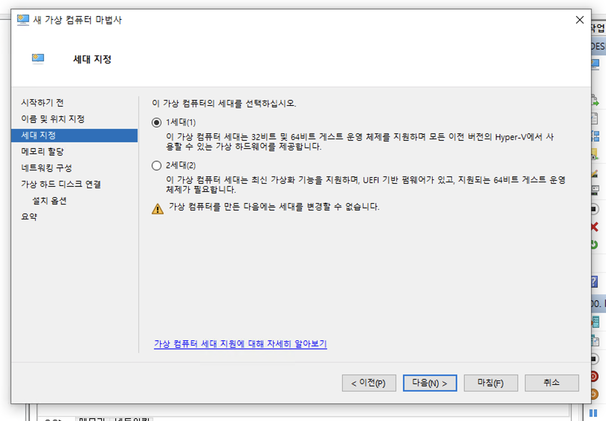
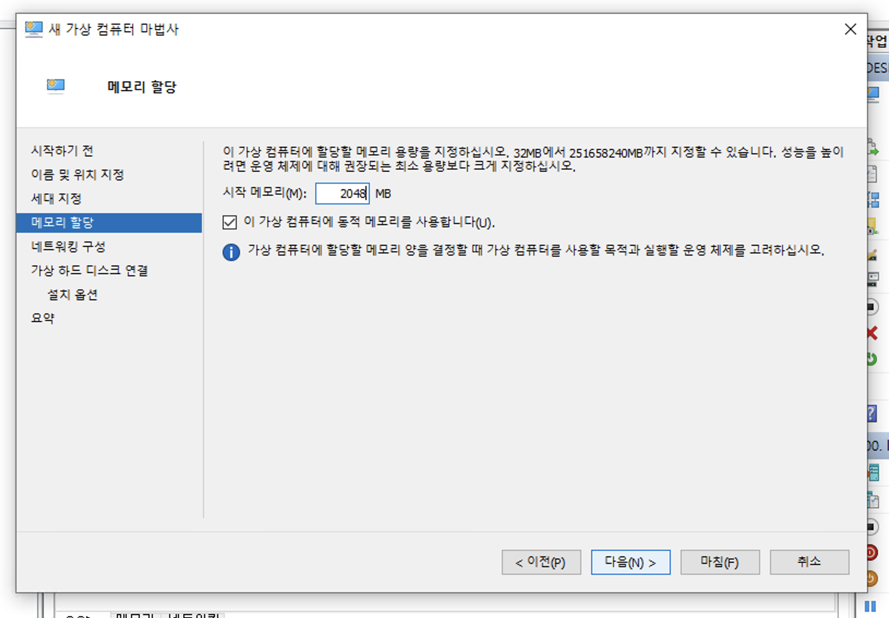
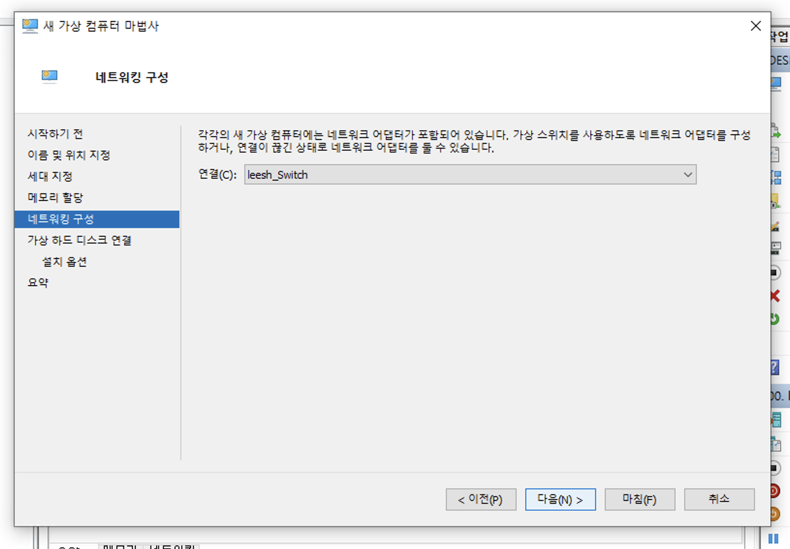
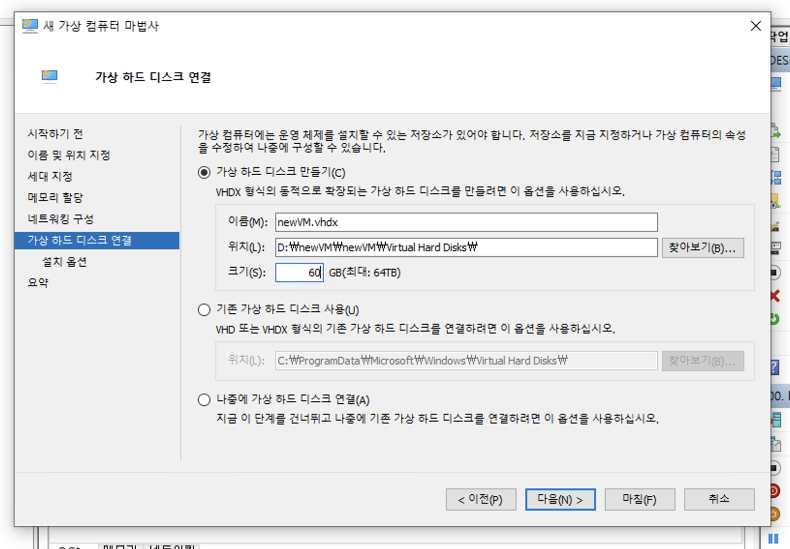
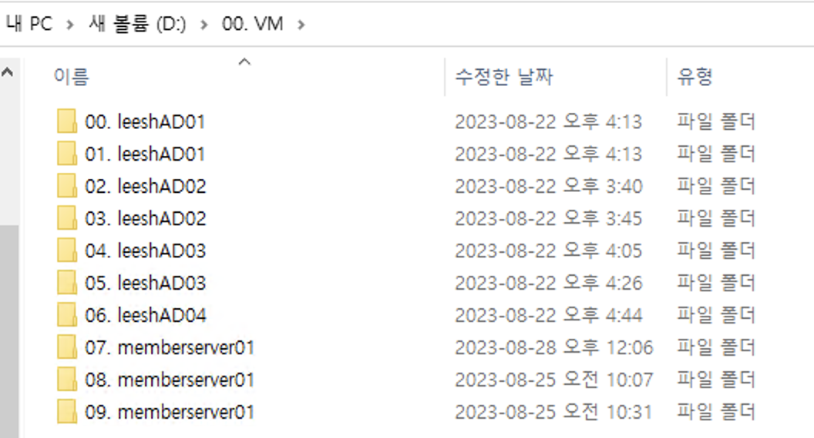
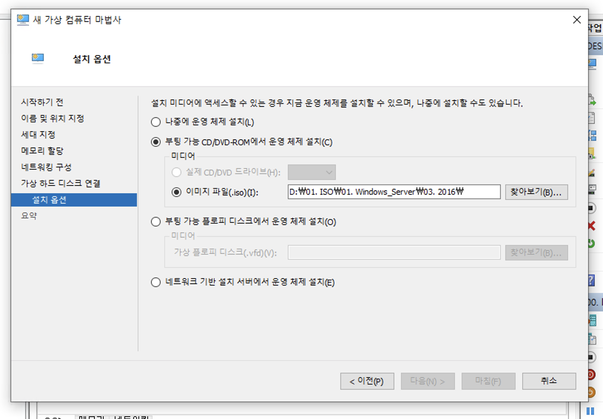

# Hyper-v 설치

제일 처음 배우게 되는 것은 가상화이다. 컴퓨터 안에 가상 컴퓨터를 만드는 기술로서 윈도우 OS에서는 이 기술을 __Hyper-v__ 라고 한다.

* Hyper-V 관리자에서 생성 가능하며, 빨리 만들기와 새로 만들기가 있는데 여기서는 새로 만들기를 할 예정이다.

 

* 가상화 컴퓨터를 생성하며 이름을 부여한다.

* 가상화 기술은 1세대와 2세대가 존재한다.
* 2세대 기술은 Windows Server 2012부터 지원한다.
* 참조: [https://learn.microsoft.com/en-us/windows-server/virtualization/hyper-v/plan/should-i-create-a-generation-1-or-2-virtual-machine-in-hyper-v](https://learn.microsoft.com/en-us/windows-server/virtualization/hyper-v/plan/should-i-create-a-generation-1-or-2-virtual-machine-in-hyper-v)

* 실습하기에는 램을 충분하게 2048(2GB)를 부여한다.

* 스위치에 관한 부분은 다음 차트에서 좀 더 자세히 설명하겠다.
* 여기서는 내부 망으로 실습하기 위하여 내부 스위치를 사용하였다.

* 하드 디스크는 60GB를 기준으로 한다.
* 가상머신보다는 스토리지를 같이 모아서 관리하는 것이 좋다.
* 스토리지가 있다면 가상 컴퓨터를 복구할 수 있기 때문이다.

* 마지막으로 OS를 설치하여 준다.
* ISO 파일을 사용하며, 필자는 Windows Server 2016으로 실습을 진행할 예정이라 2016으로 설치하였다.
