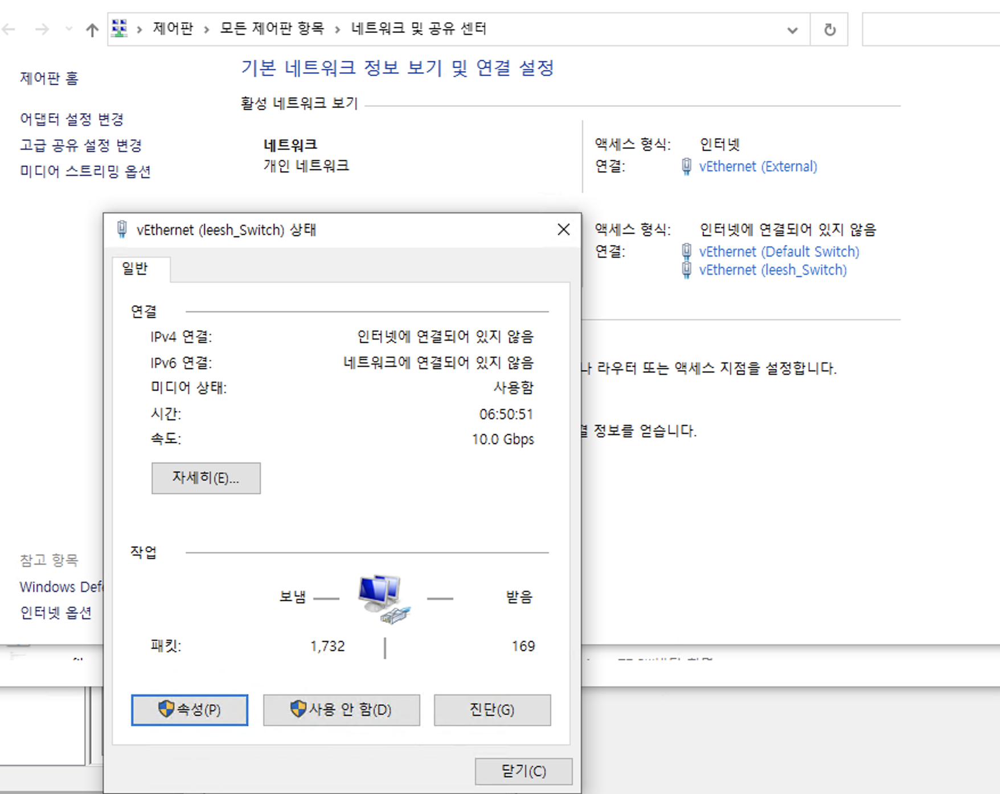

# 가상 스위치

가상 스위치는 가상 컴퓨터들의 네트워크 망을 어떻게 다룰 지에 대해서 설정하는 방법이다.  
네트워크를 다루기 위하여 굉장히 중요한 개념이다.

* 가상 스위치 관리자에서 만들 수 있다.

* 만들 수 있는 스위치의 종류는 크게 3가지로 __외부, 내부, 개인__ 이다.
* 위 3개의 스위치는 사용 시 인바운드 케이스에 사용된다.
* Default Switch는 기본적으로 생성되어 있는 스위치이며, 하나만 생성 가능하다.
* 이 스위치는 아웃바운드 케이스에 사용되면 Azure에서 생각할 때 __NAT gateway__ 와 같다.

# 외부 스위치(External Switch)

* 외부 스위치를 사용하여서 가상 머신을 만들 경우 로컬과 같은 이더넷을 사용한다.

이게 무슨 뜻이냐면 로컬 컴퓨터가 만약 공유기를 사용하여서 IP를 

* IP: 192.168.0.2
* 서브넷 마스크: 255.255.255.0  

을 사용한다고 가정했을 때 가상머신을 하나 만들어서 외부터미널에 연결하게 되면 IP를 __192.168.0.3__ 을 사용하는 것이 가능하다는 뜻이다.

# 내부 스위치(Internal Switch)

여기가 스위치 개념에서 핵심이다. 만약 여기 개념이 힘들다면 Azure의 가상 네트워크인 VNet에 대하여 공부하는 것이 좋다.

* Azure는 Hyper-v를 기반으로 가져와서 만들었으며, Vnet 개념은 내부 스위치 개념가 유사하다.
* AZ-900, AZ-700을 공부하면 도움이 된다.

* 위와 같이 내부 스위치를 선택하여 간단히 만들 수 있다.
* 내부 스위치는 하나의 네트워크 망을 만든다는 개념으로 보면 쉽다.

* 하나의 망을 만들었기 때문에 여기서 사용할 개인 IP를 만들어야 한다.
* 위치: 제어판 -> 모든 제어판 항목 -> 네트워크 및 공유 센터 -> 이더넷(내부 스위치) 속성

* ip 설정을 위하여 __인터넷 프로토콜 버전 4(TCP/IPv4)__ 속성으로 이동한다.

필자는 로컬 pc ip인 192.168.0.x와 다르게 구성하길 원한다.

* IP 주소: 10.0.0.1
* 서브넷 마스크: 255.255.255

이렇게 설정하게 되면 10.0.0.x의 IP를 사용하는 네트워크 망을 만들 수 있다.

* 가상 이더넷에 IP를 부여할 때는 무조건 x.x.x.1을 해야한다.
* 그 이유는 x.x.x.1은 게이트웨이를 뜻하기 때문이다.
* 인바운드 형식으로 접속할 때 게이트웨이를 먼저 들린다음 해당 IP주소로 가기 때문이다.

## 가상 컴퓨터 IP 설정하기

* 로컬이 아닌 VM의 이더넷 설정이다.
* 로컬에서 10.0.0.1로 게이트웨이를 설정하였기 때문에 이제 10.0.0.x로  위와 같이 원하는 IP 주소를 부여하여서 사용하면 된다.
## 가상 컴퓨터에 원격 접속하기

* 인바운드 테스트를 하기 제일 쉬운 케이스는 원격 접속이다.
* 윈도우에서는 원격 접속을 할 경우 __RDP__ 를 사용하는데 __3389__ 포트를 사용하여서 접속한다.
 
그러기 위해서 가상 컴퓨터에서 아래와 같은 절차가 필요하다

### 1. OS에서 원격 접속 허용

* 컴퓨터에 대한 원격 연결을 허용하여 준다.

### 2. 방화벽에서 3389 포트 허용

* 제어판 -> 방화벽 -> 고급 시스템 설정 -> 인바운드 규칙에 있다.
* 원격 접속을 할 수 있도록 3389 포트를 허용하여 준다.

위와 같이 한 후, 다시 로컬 PC로 이동한 후 

* 로컬에서 원격 데스크톱 연결 클릭
* 접속하고 싶은 가상 컴퓨터 IP 및 계정 아이디 비번 입력

을 하게 되면 위와 같은 결과를 확인할 수 있다.

# 개인 스위치(Private Switch)

* 외부에서 접속하지못하는 네트워크망 형태이다.
* 가상머신들만 통신을 목표로 하는 스위치이다.