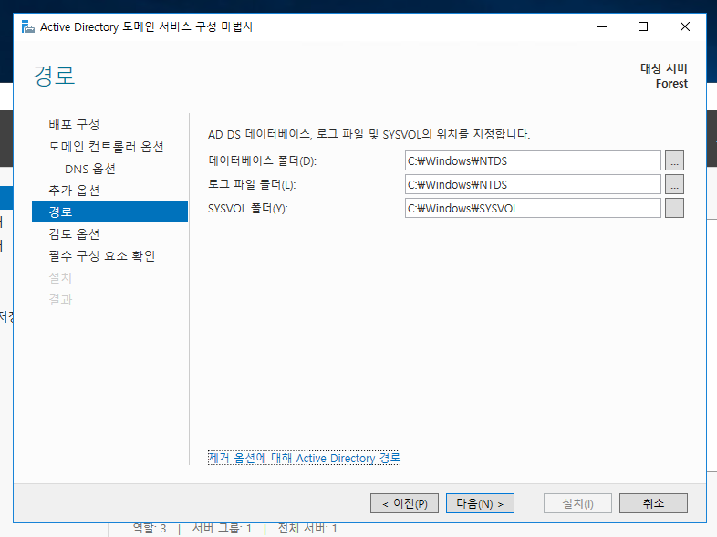

# Active Directory

Domain은 AD가 관리하는 기본적인 단위이다. 그리고 묶어서 사용하게 되는 범위의 순서는 Forest >>> Tree >>> Domain 이다.

# Forest 설치

* Forest로 등록하기 전 컴퓨터 이름을 먼저 바꾸는 것이 좋다.
* 도메인 설정이 끝난 후에 PC 이름을 바꾸면 장애가 발생할 수 있다.

* 역할 및 기능 추가를 선택

* 역할 기반 또는 기능 기반 설치

* Forest가 되는 PC를 DNS 서버로 설정하는 것이 좋다.
* IP와 스위치에 관한 내용은 __02_Switch__ 참조

* Active Directory 도메인 서비스를 선택한다.
* DNS 서버를 선택한다.

* .NET Framework 4.6 기능을 선택한다.

* Acitve Directory 도메인 서비스 내용을 읽고 다음으로 넘어간다.

* DNS 서버 내용을 읽고 다음으로 넘어간다.

* 선택한 내용들을 확인 후 설치한다.

* 이 서버를 도메인 컨트롤러로 승격을 선택한다.
* 도메인 컨트롤러는 윈도 서버 도메인 안에서 보안 인증 요청에 응답하는 서버를 뜻한다.

* 여기서 설정하는 이름이 루트 도메인이 되며, 포레스트의 이름이 된다.

* DSRM의 비밀번호를 입력한다.

* 다음으로 넘어간다.

* 도메인에 할당된 컴퓨터의 이름이다. _컴퓨터 이름과 다르다._
* 도메인에 따라서 자동으로 할당 된다.

* 다음으로 넘어간다.

* 지금까지 설정한 내용들을 검토한다.

* Forest 역할과 Domain Controller를 설치한다.

* 설치한 내용을 적용시키기 위하여 재부팅한다.

* 접속하기 위해서는 로컬이 아닌 도메인으로 로그온 해서 접속해야 한다.
* 양식은 __도메인\서버관리자__ 이다.