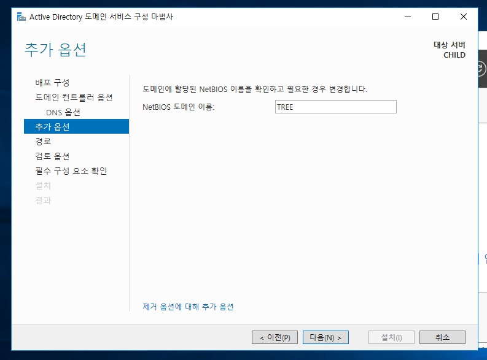

# AD_DomainController

* 도메인 컨트롤러는 권한 인증, 확인, 사용자 관리, 암호 변경 등 도메인 권한에 관련된 것을 처리하는 기능을 하는 서버 컴퓨터를 도메인 컨트롤러라고 한다.
* 짧게 DC라고들 많이 부른다.

## CHILD(Tree) DC 설치

* 도메인 서비스는 대부분 포레스트에서 많이 한다.
* 따라서 DNS에 포레스트 서버를 적어주면 된다.

* 도메인 서버시스를 설치한다.

* 포레스트를 부모 도메인으로 사용하여 자식이 되는 것이다.

* 자격 증명을 통해 포레스트 서버의 도메인을 가져온다.
* 포레스트 계정으로 로그온 한다.

* 로그온에 성공하면, 위와 같이 해당 포레스트의 도메인 나온다.

* CHILD의 도메인 명을 정한다.
* 예시로 __Tree__ 라고 새 도메인 이름을 정하면 __Tree.CorpTest.com__ 이 풀 도메인 된다.

* 자동으로 NetBios에서 정해진다.

* DC를 만들 때 사용되었던 로컬 계정이 CHILD DC 계정으로 승격이 된 것을 확인할 수 있다.
* _DC는 로컬 계정으로 로그온 하는 것이 불가능하다._  

## 기존 도메인에 도메인 컨트롤러 추가

DC로 사용하는 컴퓨터가 한 대가 아닐 수도 있다.   
따라서 기존 도메인에 도메인 컨트롤러를 추가하는 경우도 있다.

* 이 가상 컴퓨터는 CHILD2로 IP를 10.0.0.14로 잡았다.
* _IP 할당은 계속 설명하였음으로, 더 이상의 설명을 생략한다._

* __기존 도메인에 도메인 컨트롤러를 추가합니다.__ 를 선택한다.

* 기존 도메인 컨트롤러에 접속하기 위해서는 자격 증명을 통하여 도메인을 가져와야 한다.
* 위에서 만든 CHILD 컴퓨터의 도메인을 가져오기 위해서는 로그온하여야 한다.

* 자격 증명에 성공하였다면, 자식 도메인을 선택하여 가져온다.

* GC는 Global catalog인데 추후에 다시 설명하도록 하겠다.
* 쉽게 요약하면 AD 클러스터 내의 도메인들에 포함된 개체에 대한 정보를 수집하고 저장하는 저장소이다.
* User의 경우, 아이디, 비밀번호 등의 정보가 GC에 저장된다.

* 설치가 다 끝나면 접속하면 된다.
* 여기서 중요한 점은 DC는 로컬 계정으로 접속이 안된다.
* 그렇기 때문에 접속할 때 CHILD2의 계정으로는 접속이 안될 것이다.
* CHILD를 만들 당시에 계정이 DC 계정으로 되어 DC 계정 비밀번호를 입력하면 접속 된다.
